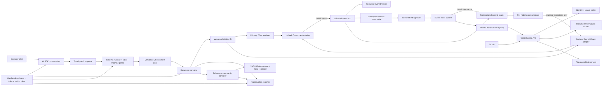

# Unifold Architecture and Implementation Plan

Date: 2026-08-24  
Audience: architecture, platform engineering, design systems, accessibility, AI product, and application teams  
Canonical repository: [unislang/unifold](https://github.com/unislang/unifold)  
Decision status: proposed target architecture  
Planning horizon: 12-month funding hypothesis, not a committed GA date; Phase 0 must reforecast scope, staffing, and confidence from measured throughput. The full stated 1.0 is unlikely to be credible in 12 months with only a 12–15 person core team unless major workstreams or catalog scope are deferred.

## Executive decision

Build the system as a contract-first platform with nine independently testable layers:

1. A versioned JSON application document whose view tree uses a pinned, explicitly profiled subset of the linked JsonUI syntax and compiles to a framework-owned intermediate representation.
2. A framework-neutral Web Component catalog implemented with Lit and compiled Tailwind styles.
3. One validated, CloudEvents-compatible envelope and read-only RxJS observable fabric for every meaningful UI fact.
4. An OSS-backed normalized control/composition graph with atomic transactions, derived rules, selectors, and selective projections.
5. An XState v5 actor system that owns temporal behavior and effects through trusted named registries and typed commands.
6. A first-class AI SDK orchestration layer that can propose and stream validated UI changes through chat.
7. A versioned Schema.org semantic graph compiled to standards-compliant JSON-LD and linked to visible UI content.
8. A replaceable server control plane for identity/tenancy, revisions, data/effects, collaboration, AI, audit, jobs, and recovery.
9. A reproducible exporter that packages the same JSON, components, compositions, machines, rules, semantics, tokens, and assets used by preview.

Do not fork JsonUI or expose its current React runtime as the enterprise API. The linked project currently provides a React renderer with `$comp`, `$children`, bindings, actions/modifiers, JSONata, validation, and state export, but it is React-only and has no published releases shown in its repository ([JsonUI repository](https://github.com/fodori/jsonui)). Parse the supported syntax into `@unislang/unifold-ir`; make `@jsonui/react` an optional compatibility adapter, not the only production renderer. The component library and primary DOM renderer remain standards-based and work in React, Vue, Svelte, plain HTML, and other Web Component hosts.

The system should normalize every declared public input and interaction, but it must not blindly serialize every JavaScript property. Files, passwords, credentials, DOM nodes, functions, and other non-JSON or sensitive values are represented by safe metadata or redacted references.

## Non-negotiable architecture principles

- JSON is data, never executable code. No `eval`, model-generated JavaScript, inline event handlers, or direct HTML injection. OWASP explicitly recommends parsing JSON rather than evaluating it and warns that serialized JSON is not safe to inject into HTML contexts ([OWASP DOM XSS guidance](https://cheatsheetseries.owasp.org/cheatsheets/DOM_based_XSS_Prevention_Cheat_Sheet.html)).
- Components are dumb by default: typed properties in, canonical events out. A component may manage only interaction-local state such as focus, open/closed state, or active descendant.
- Every addressable component, composition, form, page, and application scope is a node in one normalized control graph and observes an indexed view of the same ordered event fabric.
- One transactional runtime store, built on a selected OSS primitive, owns committed client UI/node state. A form core is accepted only if it can participate through that transaction boundary without a second authoritative value/validity copy. Components emit intents; XState/rules emit commands; renderers consume memoized projections. Server records, remote-query cache, AI proposal drafts, workflow snapshots, and widget-local interaction state have explicit separate ownership and may not silently shadow committed node state.
- A global observable is not permission to globally rerender: transactions publish coherent facts, and only changed selections update their Lit/React leaves.
- Behavior is explicit. XState owns application and workflow decisions; external effects are registered code, referenced from JSON by name.
- The browser is never an authorization boundary. The control plane derives identity/tenant context from trusted sessions and authorizes every object and effect.
- The catalog, not the model, is the authority. AI can select only registered components, variants, actions, selectors, and machine building blocks.
- Accessibility is encoded in schemas, component implementations, test fixtures, and release gates. It is not a final audit step.
- Preview and export share the same compiler and runtime artifacts. Export is not a second renderer.
- The primary product is a framework consumed by other teams. Public packages, contracts, CLI workflows, examples, documentation, migrations, and compatibility guarantees are release artifacts with the same ownership and quality bar as runtime code.
- Every durable document, catalog, event, machine, and export format is versioned and migratable.
- Adopt and contribute to proven OSS before building infrastructure; custom work is restricted to Unifold-specific integration and policy seams with an approved evidence-based exception.
- Treat maintainability limits as release contracts: cyclomatic complexity is strictly less than 4 (maximum 3), each function is at most 30 logical source lines, and every project-owned source, test, schema, configuration, and JSON definition file is at most 350 physical lines. Markdown (`*.md`) is the only file-size exemption. The limits apply equally to framework, studio, reference applications, tests, and generated project code and cannot be bypassed with inline suppressions.
- Code is concise and self-describing and follows SOLID boundaries. Names express domain intent, functions operate at one level of abstraction, dependencies and effects are explicit, and comments explain decisions or constraints rather than narrating the code.

## Bounded 1.0 product scope

“Every modern component” remains the long-term catalog direction, not the 1.0 exit condition. Build and certify 1.0 against three reference applications that force different architectural seams:

1. **Authenticated customer-operations workspace:** search/filter, virtualized results, master/detail, accessible forms, validation, autosave, optimistic mutation, conflict recovery, bulk actions, file upload, authorization changes, offline last-known-good, and audit history.
2. **Public product/catalog experience:** responsive content, navigation, product variants, availability, localization, canonical URLs, build-time prerendering, truthful Schema.org JSON-LD, strict CSP, analytics consent, and static export without an AI/server dependency.
3. **Governed approval workflow:** multi-step state machine, role/capability changes, comments, attachments, human and AI patch proposals, diff/review/approval, concurrent editors, escalation/timeouts, signed audit trail, export, and rollback.

The desired full-platform 1.0 stable catalog target is 45 components, subject to the Phase 0 evidence-based reforecast. If capacity cannot support all 45 without weakening quality, the program must explicitly move named families to a later compatible release train or move the GA date; it cannot quietly reduce evidence per component:

| Release group | Stable components |
|---|---|
| Phase 1—15 foundations | Box, Stack, Grid, Text, Heading, Icon, Button, Link, TextField, TextArea, Checkbox, RadioGroup, Select, Form, Alert |
| Phase 2—22 interaction/content | Image, Card, NumberField, SearchField, CheckboxGroup, Switch, Combobox, MultiSelect, DateField, FileInput, Field, Fieldset, ErrorSummary, Accordion, Tabs, MenuButton, Tooltip, Popover, Dialog, Toast, Breadcrumb, Pagination |
| Phase 3—8 enterprise | Table, DataGrid, VirtualList, MasterDetail, SearchResults, Wizard, Stepper, AuditLog |

Implementation checkpoint (2026-08-26): all 45 named stable component families are present in the
catalog, and the additional `Composition` structural host brings generated custom-element coverage
to 46. This closes catalog-family implementation scope, not the 1.0 program: multi-user Studio,
provisioned control-plane operations, manual browser/assistive-technology evidence, localization,
packaging/release compatibility, pilot adoption, and the remaining acceptance register still gate
stability. Toast and Pagination complete the Phase 2 list through the same JSON to IR to deferred Web
Component to canonical event to XState/command to selective projection to static export and
Playwright seams. The reference initial closure remained below its 184 KiB gzip gate after moving
authored JSON and the reference validator adapter to explicit pre-mount resources; no
catalog-completion budget exception was taken. The later explicit control-topology tranche raises
the executable ceiling by six KiB to 190 KiB for its synchronous compiler/runtime contract, with the
measured closure and rationale retained in the acceptance record.

Acceptance checkpoint (2026-08-26): the executable evidence register is maintained in
`docs/acceptance-status.md`. It deliberately distinguishes family presence from complete 1.0
proof: AC27 is proved, while the other criteria remain partial or missing until their full named
environment and recovery matrices exist. The latest risk-reduction tranche adds a packaged
`unifold validate`/`unifold generate starter` adoption path with a packed clean-consumer journey, a
governed AI SDK provider boundary with signed manifests and atomic token/cost/time budgets, and
per-application Schema.org publication ownership. Planned CLI migrate/test/export/doctor commands,
real-provider golden tasks, whole-runtime multi-app isolation, the three fixed reference products,
manual assistive-technology evidence, external pilots, public-registry release proof, and the Phase
0 evidence-based delivery reforecast remain explicit gates.

Other listed components may ship as experimental or post-1.0 extensions and cannot block GA. A component family enters a future stable target only with a named reference journey and owner.

Explicit 1.0 non-goals are arbitrary model- or user-supplied JavaScript, a public unreviewed plugin marketplace, native mobile rendering, a general-purpose CMS, simultaneous rich-text CRDT editing, guaranteed search-engine rich results, a built-in domain backend, and request-time SSR. The framework provides contracts and reference adapters; product teams still own business services, content accuracy, authorization policy, translations, and deployment approval.

## Target architecture



### Package topology

Use a pnpm workspace with Changesets and strict TypeScript project references. Reserve and publish under the npm scope `@unislang`, with `unifold-*` package names; do not target `@unifold`, which is already used by an unrelated active SDK including [`@unifold/core`](https://www.npmjs.com/package/@unifold/core). Npm ownership is a Phase 0 release prerequisite because GitHub organization ownership does not reserve the corresponding npm scope. Every published manifest declares `https://github.com/unislang/unifold.git` as its repository URL and its workspace-relative `repository.directory`; package homepages and issue links resolve to the same repository unless a package has a dedicated documentation route.

| Package | Responsibility | Must not contain |
|---|---|---|
| `@unislang/unifold` | Supported convenience entry point, compatible dependency set, runtime bootstrap, and explicit element registration | Duplicated implementations or hidden side effects |
| `@unislang/unifold-contracts` | JSON Schema 2020-12 documents, generated TypeScript types, migrations, canonical IDs | Render or network code |
| `@unislang/unifold-ir` | Versioned normalized UI intermediate representation, JsonUI profile compiler, source maps, static dependency graph, and compatibility corpus | DOM, React, mutable runtime state, or effects |
| `@unislang/unifold-catalog` | Component/action descriptors, capability queries, catalog versioning | Framework implementations |
| `@unislang/unifold-events` | `UiEvent`, DOM bridge, validation, sequencing, redaction, replay | Application business rules |
| `@unislang/unifold-reactivity` | Thin integration over RxJS plus the selected OSS immutable/store primitives: multicast ingress, read-only observables, transactions, node registry, selectors, dependency index, render invalidation | A homegrown observable or general-purpose state library |
| `@unislang/unifold-forms` | Stable Unifold adapter over the selected OSS form core: `UiControl`/group/array/record graph, aggregation, validation, update policies, form-associated element adapters | A second independent form-state engine, product messages, or workflows |
| `@unislang/unifold-compositions` | Versioned static/dynamic composition templates, parameters, slots, namespaced IDs, exported selectors/events, rule dependencies | Arbitrary executable templates |
| `@unislang/unifold-modules` | Versioned `UiModule` schema, integrity-pinned static imports, namespaced composition/resource flattening, and source maps | Runtime URL loading, package installation, executable resources, or compilation state |
| `@unislang/unifold-runtime` | Document/IR validation, data stores, bindings, renderer ports, composition root, and error boundaries | React-specific code or JsonUI syntax interpretation |
| `@unislang/unifold-renderer-dom` | Primary framework-neutral IR-to-Custom-Element renderer, keyed reconciliation, property/attribute application, and hydration/upgrade boundary | React, application state ownership, or component behavior |
| `@unislang/unifold-data` | Query/mutation/effect envelopes, cursor paging, cache/invalidation, optimistic and streaming protocols | Product endpoints or authorization policy |
| `@unislang/unifold-control-plane` | Reference server ports for identity/session, tenancy, documents/revisions, effects, AI gateway, export jobs, audit, and assets | Browser rendering or provider-specific business logic |
| `@unislang/unifold-collaboration` | Server sequencing, presence, branches, three-way patch/rebase, approvals, comments, conflict records | Domain-specific review policy |
| `@unislang/unifold-jsonui` | Optional compatibility/parity bridge between the pinned JsonUI profile, Unifold IR, and `@jsonui/react` | State authority, component internals, or required production rendering |
| `@unislang/unifold-elements` | Lit custom elements, form association, ARIA behavior, parts and tokens | Application workflows |
| `@unislang/unifold-theme` | Tailwind build, semantic tokens, density/motion/contrast themes | Runtime-generated utility names |
| `@unislang/unifold-i18n` | Message catalogs, ICU-compatible formatting, locale/direction negotiation, extraction and missing-key diagnostics | Product translations |
| `@unislang/unifold-xstate` | Machine compiler, actor hierarchy, named implementations, inspection, persistence adapters | Direct DOM manipulation |
| `@unislang/unifold-a11y` | Static rules, runtime assertions, APG fixtures, conformance manifests | Product-specific copy |
| `@unislang/unifold-semantics` | Schema.org release registry, semantic graph/binding validation, JSON-LD compiler, visibility/privacy parity checks | UI behavior, analytics, or authorization decisions |
| `@unislang/unifold-ai` | AI SDK provider registry, prompts, typed messages, tools, patch proposal protocol | Provider keys in browser code |
| `@unislang/unifold-angular` | Optional Angular bridge for `ControlValueAccessor`, Reactive Forms events, signals, dependency injection, and typed node bindings | Angular as runtime state authority or an Angular dependency in core packages |
| `@unislang/unifold-studio` | Chat, canvas, tree, property panel, timeline, state graph, review UI | Alternate production runtime |
| `@unislang/unifold-export` | JSON bundle, static app, embeddable package, manifest/hash generation | Secret material |
| `@unislang/unifold-testkit` | Component harness, event assertions, model-based and accessibility helpers | Product fixtures |
| `@unislang/unifold-playwright` | Generated component/journey fixtures, browser projects, accessibility/visual/event assertions, export parity, CI reporting | Product-specific credentials or production data |
| `@unislang/unifold-tooling` | Shared ESLint/TypeScript/formatting configuration, cross-language file-size checker, dependency and cycle rules, quality manifest, and local/CI commands | Runtime behavior or package-specific policy exceptions |
| `@unislang/unifold-docs` | Versioned documentation portal, generated API/schema/catalog references, tutorials, recipes, architecture decisions, migration guides, and runnable examples | Undocumented alternate APIs or untested copied snippets |
| `@unislang/unifold-devtools` | Event/state timeline, component picker, document diff, replay | Application decisions |
| `@unislang/unifold-telemetry` | Trace/metric/log schemas, privacy transforms, SLO measurement, health instrumentation | Vendor-specific exporters in core contracts |
| `@unislang/unifold-cli` | Validate, migrate, generate, test, export, inspect, and doctor commands exposed through the `unifold` binary | Hidden alternate compiler behavior |

### Framework distribution and documentation contract

Ship the framework as independently versioned but compatibility-tested packages, not as source copied from the studio. Publish standards-based ESM packages with declarations, source maps, export maps, side-effect metadata, integrity/provenance attestations, licenses, and SBOMs. Keep internal modules private; consumers use documented package exports and never deep-import implementation paths. Declare peer dependencies and browser/runtime requirements explicitly, provide a compatibility matrix and Changesets-driven release notes, and test clean installation in representative npm/pnpm/yarn consumer workspaces. The framework must work without the studio, AI service, or reference control plane when those capabilities are not selected.

Custom-element registration is a realm-wide compatibility constraint: the global registry cannot define the same tag twice, so two incompatible `unifold-*` catalog majors cannot coexist in one document realm. Publish side-effect-free class exports plus one explicit idempotent `defineUnifoldElements()` registration entry point; detect an already-registered incompatible catalog before rendering and return a diagnostic rather than throwing midway. Support one catalog major per realm, deduplicate Lit, and require an iframe/independent realm for incompatible majors until scoped registries are baseline-capable. Lit's publishing guidance likewise warns that duplicate registrations fail and that multiple Lit copies add bytes ([Lit publishing](https://lit.dev/docs/v2/tools/publishing/), [Lit development guidance](https://lit.dev/docs/tools/development/)).

Provide three supported adoption paths: a CLI-created starter workspace, incremental installation into an existing application, and a prebuilt/embeddable `<unifold-application>` package. Each path includes plain HTML and supported React, Vue, Svelte, and Angular examples; a minimal local adapter; production adapter contracts; tree-shaking and CSP guidance; theming and token setup; generated Playwright configuration; and a documented eject/export path. Extension authors receive a public SDK, package template, compatibility harness, permission model, and stable catalog-registration API.

Documentation is a versioned part of each package release and is organized by user task rather than repository layout:

- a conceptual guide explaining documents, nodes, the unified `events$`, transactions, selectors, actors, effects, compositions, semantics, and trust boundaries;
- a quick start that reaches an accessible JSON-defined form and passing Playwright journey from a clean install;
- generated API, Custom Elements Manifest, JSON Schema, event, command, component, composition, token, and CLI references linked back to their owning versions;
- recipes for forms, master/detail, dynamic lists, validation, effects/data, XState workflows, Schema.org, AI chat editing, accessibility, localization, theming, export, testing, and framework integration;
- architecture, security/privacy, accessibility, operations, troubleshooting, deprecation, migration, and upgrade guides with tested rollback paths;
- runnable reference applications and small focused examples whose source is the documentation snippet source of truth.

Documentation CI builds every supported version, validates internal/external links and schema examples, compiles all TypeScript snippets, executes runnable examples and their Playwright smoke journeys, checks accessibility and search metadata, and detects generated-reference drift. A public API, component, event, JSON field, CLI option, behavior change, or deprecation cannot merge without its matching documentation and migration impact. Markdown is exempt only from the 350-line source-file limit; it is not exempt from review, linting, accessibility, link, example, freshness, or ownership gates. Measure time-to-first-success and documentation task completion with opt-in, privacy-safe research; treat repeated support questions as missing product documentation or developer experience.

### Why Lit for the elements

Lit components are custom elements with reactive property/attribute APIs and open shadow roots by default ([Lit properties](https://lit.dev/docs/components/properties/), [Lit shadow DOM](https://lit.dev/docs/components/shadow-dom/)). It is a thin implementation choice behind standard browser contracts, not a consumer framework dependency. Use native HTML controls inside the shadow tree whenever they can satisfy the behavior. Use form-associated custom elements and `ElementInternals` only for controls that cannot be expressed by a native control ([WHATWG custom elements](https://html.spec.whatwg.org/dev/custom-elements.html)).

General request-time SSR is not a GA dependency: Lit’s SSR and hydration packages remain in its Labs family and document partial DOM emulation and hydration constraints ([Lit SSR](https://lit.dev/docs/ssr/overview/), [Lit client hydration](https://lit.dev/docs/ssr/client-usage/)). Build-time prerendering is still SSR and is therefore a P0 feasibility seam, not a free export feature. The spike must prove no-JavaScript visible public content, Declarative Shadow DOM/light-DOM strategy, upgrade without duplicate DOM or events, focus/form preservation, strict CSP, crawler-visible metadata, and parity in all supported engines. If the Labs path fails, export public content through a deterministic light-DOM/static renderer while keeping interactive application rendering client-side. Graduate request-time SSR only after a separate multi-tenant isolation, hydration, event-parity, browser, performance, and operational compatibility gate.

## Canonical JSON application contract

The public artifact is `UiDocument`, not the runtime’s internal component tree. Its `view` member conforms to a named `jsonUiProfile` pinned to an upstream commit/version and an executable compatibility corpus. The profile preserves the JsonUI node syntax while declaring exactly which components, slots, bindings, actions, modifiers, validations, JSONata features, and state-export semantics are supported, rejected, or compiled into Unifold equivalents. This is necessary because the upstream runtime is React-specific and does not currently publish a stable independent interchange standard.

```json
{
  "$schema": "https://schemas.unifold.org/ui-document/1.0/schema.json",
  "schemaVersion": "1.0.0",
  "id": "customer-editor",
  "revision": "01J...",
  "jsonUiProfile": { "name": "unifold-jsonui", "version": "1.0.0", "upstream": "commit-sha" },
  "imports": [{ "module": "@acme/customer-compositions", "version": "2.1.0", "as": "customer" }],
  "catalog": { "name": "core", "version": "1.4.0" },
  "theme": { "name": "enterprise", "version": "1.1.0", "density": "comfortable" },
  "stores": [
    {
      "id": "customer",
      "schema": "https://schemas.example.com/customer-draft/2.0.json",
      "source": { "kind": "host" },
      "access": "read-write-draft",
      "persistence": "session",
      "classification": "internal"
    }
  ],
  "semantics": {
    "contractVersion": "1.0.0",
    "vocabulary": { "uri": "https://schema.org", "release": "30.0" },
    "primaryEntity": "urn:unifold:customer:current",
    "entities": [
      {
        "@id": "urn:unifold:customer:current",
        "@type": "Person",
        "properties": {
          "name": { "$value": { "store": "customer", "path": "/name" } },
          "email": { "$value": { "store": "customer", "path": "/email" } }
        }
      }
    ],
    "publication": { "mode": "public-page", "profile": "schema.org" }
  },
  "view": {
    "$comp": "Form",
    "id": "customer-form",
    "$children": [
      {
        "$comp": "TextField",
        "id": "customer-email",
        "store": "customer",
        "path": "/email",
        "label": "Email address",
        "required": true,
        "autocomplete": "email"
      },
      {
        "$comp": "Button",
        "id": "save-customer",
        "label": "Save",
        "variant": "primary"
      }
    ]
  },
  "machines": [
    {
      "id": "customer-workflow",
      "version": "1.0.0",
      "initial": "editing",
      "states": {
        "editing": { "on": { "form.submit": "saving" } },
        "saving": { "invoke": { "src": "saveCustomer", "onDone": "saved", "onError": "editing" } },
        "saved": { "type": "final" }
      }
    }
  ],
  "bindings": [
    {
      "on": "org.unifold.ui.form.submit.v1",
      "from": "customer-form",
      "sendTo": "customer-workflow",
      "as": "form.submit"
    }
  ],
  "policies": {
    "aiMutation": "review-behavior",
    "eventRetention": "commits-only",
    "dataClassification": "internal"
  }
}
```

### Schema rules

- Use JSON Schema Draft 2020-12 for `UiDocument`, `UiModule`, `StoreDefinition`, `SemanticGraph`, component props/snapshots, `CompositionDefinition`, control trees, derived rules, events/commands/transactions, machine JSON, data/effect/control-plane/realtime envelopes, revision/conflict records, patch proposals, `TestScenario`, export manifests, and persisted snapshots ([JSON Schema 2020-12](https://json-schema.org/draft/2020-12)). Generate TypeScript and protocol documentation from the schemas; do not maintain parallel hand-written shapes.
- Complex applications are authored as small versioned `UiModule` files imported by package/module ID and exact compatible version, with explicit exports for compositions, machines, rules, schemas, tokens, messages, semantics, and scenarios. The resolver namespaces IDs, detects import and dependency cycles, pins integrity, reports source locations through IR source maps, and never follows an arbitrary runtime URL or remote `$ref`. Source remains within the 350-line limit; an ignored/generated flattened deployment artifact may be larger but is not an editable source of truth.
- Every named store has a `StoreDefinition` declaring portable JSON Schema, trusted source adapter, initial-data contract, read/write policy, ownership, persistence/offline scope, classification, size limit, and migration range. Validate every binding and JSON Pointer against its store schema, including value type, nullability, mutability, and classification flow. Initial or remote product data is injected through the declared adapter and is not silently embedded in a reusable document/export.
- Require stable IDs for every interactive, stateful, addressable, or AI-editable node. IDs are document-unique and survive reorder/move operations.
- Use semantic versioning for contracts and catalog packages. Additive optional fields are minor; removed/renamed fields or changed semantics are major.
- Every major schema has pure, tested migrations and a declared supported input range. Never silently reinterpret an old document.
- Use JSON Pointer for data paths. Keep JsonUI JSONata support as an opt-in extension with expression length/depth/time limits. AI may choose only registered transformations by ID in production.
- Reject unknown component types, unknown props, unknown action/guard/actor names, duplicate IDs, cycles, invalid slots, illegal nesting, and unsupported catalog ranges before rendering.
- Preserve a last-known-good compiled document. Invalid remote or AI output never replaces it.

## Schema.org semantic markup architecture

Treat machine-readable domain semantics as a first-class, versioned graph associated with `UiDocument`, but do not confuse it with HTML accessibility semantics, the component catalog, analytics, `UiEvent`, or XState behavior. A `Person` entity can be rendered by many components; clicking a button does not automatically become a Schema.org `Action`, and adding a Schema.org type never grants an application capability.

### Canonical semantic contract

`SemanticGraph` contains stable entity `@id` values, Schema.org `@type` values, typed properties, page-level relationships such as `mainEntity`, and safe constant or store-path bindings. Its compiler resolves those bindings against the same committed snapshot used to render the visible page and emits [JSON-LD 1.1](https://www.w3.org/TR/json-ld11/) with `@context: "https://schema.org"`. JSON-LD is the baseline because it represents nested graphs cleanly without coupling vocabulary markup to each component's DOM. Optional Microdata or RDFa adapters may be added for a verified consumer requirement, but they are not parallel authoring formats.

Generate the allowed type/property registry from a pinned official Schema.org release snapshot. The document records the intended release, while emitted terms continue to use stable `https://schema.org/...` identifiers. As of this plan, the current published release is 30.0; Schema.org publishes named releases and machine-readable snapshots specifically for change control ([Schema.org releases](https://schema.org/docs/releases.html), [versioning process](https://schema.org/docs/howwework.html)). Pending/staging terms and external vocabularies require an explicit namespaced extension, owner, compatibility policy, and experimental status; AI does not select them by default.

Validation has four levels:

1. **Structural:** validate the `SemanticGraph` schema, stable/unique `@id`, binding paths, supported scalar/entity/list forms, graph size/depth, and absence of cycles that the selected profile forbids.
2. **Vocabulary:** reject unknown or superseded terms unless an approved extension owns them; report expected `domainIncludes`/`rangeIncludes` mismatches as actionable diagnostics. Schema.org is intentionally flexible, so these expectations are not universally treated as closed-world errors ([Schema.org data model](https://schema.org/docs/datamodel.html)).
3. **Publication profile:** apply stricter required/recommended properties and policies for declared consumers such as a search rich-result profile. A generic Schema.org-valid graph does not imply eligibility for any vendor feature.
4. **Truth/privacy parity:** every public value must be derived from visible page content or an approved public source, remain current, and pass field-level classification. Hidden, permission-restricted, internal, secret, draft, or cross-tenant values are rejected before JSON-LD serialization. Search guidance likewise requires structured data to truthfully represent visible content ([Google structured-data guidelines](https://developers.google.com/search/docs/appearance/structured-data/sd-policies)).

### Rendering and lifecycle

- Emit one deterministic `<script type="application/ld+json" data-unifold-semantics>` in the document `<head>` or light DOM application shell, plus an optional `.jsonld` export sidecar. Public static exports place it in build-time prerendered HTML; do not hide the only semantic graph inside component shadow roots or depend on post-load AI/data calls for required assertions.
- Build the script node with a trusted serializer and `textContent`; escape HTML script-closing sequences, prohibit functions/HTML, constrain URLs and remote contexts, and apply CSP. Never concatenate JSON-LD into an HTML string.
- Update the graph only after a valid application/document commit, coalesce rapid changes, and atomically replace the prior block. Loading, invalid, unauthorized, and optimistic values are omitted unless their publication policy explicitly permits them.
- Preserve stable public/canonical entity identifiers across rendering and export. Local `urn:` identifiers are valid for previews; publishable exports require canonical URLs or an explicit identity-mapping step.
- A document-head coordinator merges graphs from multiple mounted `unifold-application` roots by canonical `@id`, rejects incompatible values/types or duplicate block ownership, preserves language-tagged values, and emits one deterministic block. Unmount removes only the contributing application's assertions.
- A page may declare no public semantic graph. Administrative applications often contain no indexable public content; generating speculative markup is worse than omitting it.

The initial publication-profile registry covers generic Schema.org plus explicit `WebSite`, `WebPage`, `Organization`, `Person/ProfilePage`, `Product`, `Article`, `BreadcrumbList`, `Dataset`, `Event`, and `SoftwareApplication` profiles. Each profile defines owner, intended consumer, required/recommended properties, visible-content mapping, canonical-ID and localization rules, external validator/test procedure, freshness policy, and migration behavior for superseded terms. Profile owners approve production accuracy and respond to consumer-policy changes; the framework team owns serialization and vocabulary compatibility, not the truth of product content or eligibility for rich results.

### Component and studio integration

Content-oriented component definitions declare semantic attachment points—subject, property, ordered collection position, visible value, URL/image/date normalization, and whether hidden content is permitted—without hard-coding a domain type. Layout and control components normally declare none. The catalog supplies reusable templates for common `WebSite`, `WebPage`, `Organization`, `Person`, `Product`, `Article`, `BreadcrumbList`, `Dataset`, `Event`, and `SoftwareApplication` compositions, but templates never fabricate required data.

The studio adds a semantic graph/entity inspector, vocabulary-aware property picker, visible-content linkage, release/profile selector, diagnostics, and preview of the exact JSON-LD. AI may propose semantic entities and bindings through `UiPatchProposal`, but catalog/vocabulary allowlists, public-data classification, truth-parity validation, and human review apply before publication. Semantic edits appear in the same document revision history and diff, while semantic validation results remain distinct from accessibility results.

## Unified event model

### Envelope

Adopt a CloudEvents 1.0-compatible application profile. CloudEvents standardizes `id`, `source`, `specversion`, and `type`, with optional `subject`, `time`, `dataschema`, and content type ([CloudEvents specification](https://github.com/cloudevents/spec/blob/main/cloudevents/spec.md)). The browser carrier is always:

```ts
new CustomEvent<UiEvent>('unifold-event', {
  detail: envelope,
  bubbles: true,
  composed: true,
  cancelable: envelope.data.phase === 'intent'
});
```

Both `bubbles` and `composed` are required for custom events to cross shadow DOM boundaries ([Lit events](https://lit.dev/docs/v2/components/events/), [MDN Event.composed](https://developer.mozilla.org/en-US/docs/Web/API/Event/composed)).

```json
{
  "specversion": "1.0",
  "id": "01J...",
  "source": "urn:unifold:surface:customer-editor:component:customer-email",
  "type": "org.unifold.ui.field.commit.v1",
  "subject": "customer-email",
  "time": "2026-08-24T16:00:00.000Z",
  "datacontenttype": "application/json",
  "dataschema": "https://schemas.unifold.org/events/field-commit/1.0/schema.json",
  "correlationid": "01J...",
  "causationid": "01J...",
  "transactionid": "01J...",
  "sequence": 184,
  "staterevision": 73,
  "traceparent": "00-...-...-01",
  "data": {
    "phase": "state",
    "sourceNode": {
      "id": "customer-email",
      "instanceId": "customer-editor::customer-form::customer-email",
      "kind": "control",
      "parentId": "customer-form",
      "scopePath": ["customer-editor", "main", "customer-form", "customer-email"],
      "path": "/view/$children/0",
      "type": "TextField",
      "tag": "unifold-text-field",
      "version": "1.2.0"
    },
    "snapshot": {
      "revision": 12,
      "base": {
        "mounted": true,
        "visible": true,
        "disabled": false,
        "readonly": false,
        "busy": false,
        "focused": false
      },
      "attributes": { "required": "", "autocomplete": "email" },
      "properties": { "label": "Email address", "required": true },
      "control": {
        "value": "person@example.com",
        "rawValue": "person@example.com",
        "status": "valid",
        "dirty": true,
        "touched": true,
        "pending": false,
        "errors": []
      }
    },
    "change": {
      "path": "/control/value",
      "trigger": "keyboard",
      "nativeType": "change",
      "previous": "",
      "current": "person@example.com",
      "reason": "user-commit"
    },
    "runtime": {
      "documentId": "customer-editor",
      "documentRevision": "01J...",
      "surfaceId": "main",
      "locale": "en-US"
    }
  }
}
```

### Event semantics

Define a small orthogonal vocabulary rather than mirroring every browser event:

- Lifecycle: `component.ready`, `component.error`, `component.destroyed`.
- Control: `control.input`, `control.value.changed`, `control.status.changed`, `control.pristine.changed`, `control.touched.changed`, `control.validation.started`, `control.validation.completed`.
- Field compatibility aliases: `field.input`, `field.commit`, `field.focus`, `field.blur`; aliases normalize to the control vocabulary before state processing.
- Selection: `selection.change`, `selection.commit`, `selection.clear`.
- Disclosure/overlay: `disclosure.open`, `disclosure.close`, `overlay.open`, `overlay.close`.
- Action/navigation: `action.intent`, `action.invoke`, `action.success`, `action.failure`, `navigation.intent`, `navigation.complete`.
- Forms/data: `form.submit`, `form.reset`, `form.valid`, `form.invalid`, `data.request`, `data.success`, `data.failure`.
- Composition/transaction: `composition.instantiated`, `composition.removed`, `rule.evaluated`, `command.applied`, `transaction.committed`, `transaction.rejected`, `selection.changed`, `render.completed`.
- AI/document: `ai.request`, `ai.delta`, `ai.proposal`, `ai.approved`, `ai.rejected`, `document.patch`, `document.published`, `export.request`, `export.complete`.

Each type has its own versioned `data` schema but uses the same envelope. `intent` events may be canceled before effects. Past-tense fact events are immutable and cannot be canceled.

### What “all properties and attributes are accessible” means

Every catalog descriptor declares:

- JSON-serializable public properties and their defaults;
- reflected HTML attributes and property mappings;
- read-only public state included in snapshots;
- event types and interaction payloads;
- which values are `public`, `internal`, `confidential`, `restricted`, or `never-export`;
- redaction, hashing, reference, size, and retention behavior.

The committed node snapshot contains every declared safe field, not private class state or internal shadow DOM. Ordinary public facts may include that complete snapshot and change. Internal, confidential, restricted, and never-export facts are metadata-only: they retain source identity, routing, causality, snapshot revision, and an event-specific metadata allowlist while omitting snapshots and value-bearing changes. Derived store-write facts are metadata-only even for public stores. Transactions use the most restrictive pre/post classification among changed nodes, forms use the most restrictive classification in their scope, and exception facts never contain raw exception text. Authorized in-process consumers can synchronously resolve the full declared snapshot by node ID/revision, so accessibility does not require duplicating values into every event. Password values are always omitted. File inputs expose count, MIME types, sizes, and opaque IDs—not bytes or local paths. Functions, nodes, actor refs, abort signals, and provider clients are never serialized. Confidential field values are excluded from AI, telemetry, persistence, and general observers unless an explicit scoped policy and user purpose allow them.

### Event hub and XState routing

The root runtime installs one `unifold-event` listener as the only DOM ingress to the application fabric. This bubbling event is trusted transient ingress for value-bearing interaction data, not a public telemetry surface. Its envelope is still validated rather than treated as authoritative. The private ingress and public-safe `events$` are distinct capabilities: DOM payloads do not become observable facts until processed. The hub performs, in order:

1. Resolve the registered source node and reject unknown, stale, duplicate, or unmounted IDs.
2. Validate the component-specific intent schema, maximum size/rate, and declared payload fields.
3. Assign event/transaction sequence, correlation, causation, state revision intent, and W3C trace context; classify/redact before any queued consumer.
4. Resolve candidate control reducer, bindings, dependent rules, and owning actors through indexes rather than a broadcast scan.
5. Run the bounded transaction pipeline and deliver typed events to relevant XState actors; actors and rules return commands rather than mutating views.
6. Atomically commit or reject, then publish ordered immutable facts to the one read-only `events$` and changed selections.
7. Fan out separately authorized and further-redacted facts to devtools/telemetry and schedule approved asynchronous effects; results re-enter through normal ingress.

DOM dispatch is synchronous, so the handler performs only bounded validation, synchronous guards, and transaction queuing/commit work required for the interaction contract; logging, analytics, AI context, and external effects move to queued channels. High-rate `input`, pointer, resize, and drag intents may be coalesced before state commit according to component policy. Accepted commit, submit, navigation, approval, error, and transaction facts are never dropped.

XState actors process messages sequentially and keep private state, which gives the ordering and isolation needed for composable enterprise behavior ([XState actors](https://stately.ai/docs/actors)). Use this hierarchy:

- one root application actor;
- one actor per mounted surface or major feature;
- invoked actors for bounded workflows such as save, upload, or checkout;
- spawned actors for dynamic entities such as rows or tabs only when they own meaningful lifecycle/state;
- optional local machines for complex widgets such as combobox, grid, dialog, and date picker.

A simple button does not need an actor. Its click is still visible in the canonical timeline and can drive the nearest owning actor. This achieves button-level observability without actor explosion.

Pin stable XState v5. Its `setup` API lets JSON machine definitions reference actions, actors, guards, and delays by serializable names ([XState machines](https://stately.ai/docs/machines)). Do not use v6-alpha APIs in a production baseline. Inspection feeds the visual event/state timeline and graph with actor lifecycle, events, snapshots, and microsteps ([XState inspection](https://stately.ai/docs/inspection)).

## Unified reactive control and composition model

The core runtime contract is deliberately analogous to Angular Reactive Forms, generalized from form controls to every addressable UI node. Angular exposes one unified `events` observable on controls and aggregates child value/status changes through groups; events retain the originating control ([Angular reactive forms](https://angular.dev/guide/forms/reactive-forms), [Angular `AbstractControl`](https://angular.dev/api/forms/AbstractControl?tab=description)). Unifold adopts those useful properties while guaranteeing transaction-final parent snapshots and extending the hierarchy through component, composition, form, page, and application scopes.

### One event fabric, many indexed views

Each mounted application owns exactly one hot, multicast, ordered `Observable<UiEvent>` named `events$`. A private RxJS `Subject` may implement publication because Subjects multicast one execution to many observers ([RxJS Subject](https://rxjs.dev/guide/subject)), but neither components nor application code receive the Subject or can call `next`, `error`, or `complete`. They receive only read-only observable/selector handles. Runtime failures are typed events and do not terminate the application stream; it completes only when the application runtime is disposed.

“One stream” means one per explicit `UnifoldRuntime` application instance, never a browser-window singleton. Multiple embedded applications, tenants, previews, tests, and incompatible catalog realms have isolated fabrics, stores, actor systems, IDs, telemetry context, and disposal. A host may create a separately authorized, redacted observation stream that merges facts from several runtimes, but it cannot route commands or expose cross-tenant snapshots through that view.

```ts
interface UiEventFabric {
  readonly events$: Observable<UiEvent>;
  getSnapshot(id: UiNodeId): UiNodeSnapshot;
  getTransaction(revision: number): UiTransactionRecord | undefined;
  node(id: UiNodeId): UiNodeHandle;
  scope(id: UiNodeId): UiScopeHandle;
  select<T>(selector: UiSelector<T>, equal?: Equality<T>): UiSelection<T>;
}

interface UiNodeHandle {
  readonly id: UiNodeId;
  readonly events$: Observable<UiEvent>; // derived from the application fabric
  readonly snapshot: UiNodeSnapshot;
  select<T>(selector: UiNodeSelector<T>, equal?: Equality<T>): UiSelection<T>;
}

interface UiSelection<T> {
  get(): T;
  readonly changes$: Observable<T>;
  subscribe(listener: (value: T) => void): Unsubscribe;
}
```

`node(id).events$`, `form.events$`, `page.events$`, and `composition.events$` are indexed views of the same public-safe fabric, not independent emitters. A source event carries its complete `scopePath`, so a form/page/application subscriber sees descendant changes without re-emission or event copying. Direct `events$` subscriptions are for orchestration, diagnostics, integration, and tests; rendering uses memoized selections.

Do not implement thousands of runtime subscriptions as thousands of RxJS `filter` chains over every event. The hub maintains indexes by source ID, ancestor scope, event type, changed state path, binding, and rule dependency. It resolves the small candidate set first, then publishes to interested handles. The public root `events$` still observes the same ordered facts.

The stream is hot and does not replay an unbounded history. Late subscribers synchronously read `getSnapshot`/`selection.get()` and then observe later changes. Devtools and audit persistence are explicit bounded consumers, not a `ReplaySubject` hidden in the runtime.

### Normalized node and control graph

The compiler creates one normalized graph keyed by deterministic `UiNodeId`. Array position, DOM order, React key, label text, and CSS selector are never identity. Static IDs come from JSON; a composition instance creates `instanceId::localId`; dynamic arrays require a durable item key. Duplicate or unstable identities fail compilation.

All nodes share a base snapshot, while value-bearing nodes add control state and each component adds only catalog-declared public fields. Every finite public string vocabulary is defined once as a named string enum, emitted as a JSON Schema `enum`, and reused by TypeScript, validators, documentation, AI schemas, and generated clients. Numeric enums and inline string-literal unions are prohibited in public contracts because their runtime and wire representations are less explicit.

```ts
enum UiNodeKind {
  Application = 'application',
  Page = 'page',
  Surface = 'surface',
  Composition = 'composition',
  Form = 'form',
  Group = 'group',
  Array = 'array',
  Record = 'record',
  Control = 'control',
  Component = 'component'
}

enum UiControlStatus {
  Valid = 'valid',
  Invalid = 'invalid',
  Pending = 'pending',
  Disabled = 'disabled'
}

enum UiUpdateTrigger {
  Input = 'input',
  Blur = 'blur',
  Submit = 'submit'
}

interface UiNodeSnapshot<TSpecific = JsonObject, TValue = JsonValue> {
  id: UiNodeId;
  instanceId: string;
  kind: UiNodeKind;
  type: string;
  definitionVersion: string;
  parentId?: UiNodeId;
  scopePath: UiNodeId[];
  revision: number;
  base: {
    mounted: boolean;
    visible: boolean;
    interactive: boolean;
    disabled: boolean;
    readonly: boolean;
    busy: boolean;
    focused: boolean;
    dataClassification: DataClassification;
  };
  attributes: Record<string, string>;
  properties: TSpecific;
  control?: UiControlState<TValue>;
}

interface UiControlState<TValue> {
  value: TValue;       // disabled descendants excluded for aggregate controls
  rawValue: TValue;    // includes disabled descendants
  initialValue: TValue;
  status: UiControlStatus;
  errors: UiValidationError[];
  pristine: boolean;
  dirty: boolean;
  touched: boolean;
  pending: boolean;
  required: boolean;
  updateOn: UiUpdateTrigger;
}
```

The graph stores nodes, parent/child edges, scope membership, bindings, rule dependencies, actor ownership, and current immutable snapshots separately from the JSON view tree. It uses structural sharing: a transaction replaces only changed node snapshots and changed ancestor aggregates. Full public properties and component-specific values remain synchronously accessible by ID even when a high-rate event contains a size-limited or redacted change payload.

Buttons, headings, layout nodes, pages, and non-value components are still `UiNodeHandle`s and emit to the same stream; they simply have no `control` member. `Form`, group, array, record, and input nodes implement `UiControlHandle<T>` with typed `value$`, `status$`, `errors$`, and methods such as `setValue`, `patchValue`, `reset`, `markTouched`, `disable`, and `validate`. Those observables are selections over the one control graph, not new sources of truth.

### Transaction and state/effect lifecycle

Components emit normalized user **intents**; they do not mutate application state. The runtime processes one transaction at a time:

1. Capture the composed DOM intent and resolve the registered node ID.
2. Validate, classify, redact, assign transaction/causation metadata, and reject stale/unmounted sources.
3. Resolve candidate control reducer, bindings, dependency rules, and owning XState actors from indexes.
4. Let synchronous guards accept/reject the intent and produce typed `UiCommand` values; no subscriber mutates state directly.
5. Apply leaf changes to a draft normalized graph, run synchronous validators, recompute affected ancestors, and evaluate dependent pure rules once in topological order.
6. Validate the proposed graph invariants and atomically commit one monotonically increasing state revision, or commit nothing.
7. Publish ordered immutable fact events—source change, affected aggregate status/value changes, commands applied, and transaction committed—after every selector can read the final coherent snapshot.
8. Notify only selections whose equality comparison changed and batch their render projections in one microtask.
9. Start approved asynchronous validators/effects with transaction, node, actor, request, and abort identities. Completion, failure, timeout, or cancellation enters as a new intent/transaction and stale results are rejected.

```ts
enum UiCommandType {
  ControlSetValue = 'control.set-value',
  ControlSetStatus = 'control.set-status',
  NodePatchProperties = 'node.patch-properties',
  StructureInstantiate = 'structure.instantiate',
  StructureRemove = 'structure.remove',
  FocusRequest = 'focus.request',
  AnnouncementRequest = 'announcement.request',
  NavigationRequest = 'navigation.request',
  EffectInvoke = 'effect.invoke'
}

type UiCommand =
  | { type: UiCommandType.ControlSetValue; id: UiNodeId; value: JsonValue }
  | { type: UiCommandType.ControlSetStatus; id: UiNodeId; status: UiControlStatus }
  | { type: UiCommandType.NodePatchProperties; id: UiNodeId; patch: JsonPatch }
  | { type: UiCommandType.StructureInstantiate; parentId: UiNodeId; definition: string; key: string }
  | { type: UiCommandType.StructureRemove; id: UiNodeId }
  | { type: UiCommandType.FocusRequest; id: UiNodeId }
  | { type: UiCommandType.AnnouncementRequest; messageKey: string; params?: JsonObject }
  | { type: UiCommandType.NavigationRequest; target: RegisteredRoute }
  | { type: UiCommandType.EffectInvoke; capability: string; input: JsonObject };
```

The lifecycle is therefore `intent → accepted/rejected → state transaction → fact events → selective render → approved effect → result transaction`. Correlation, causation, transaction ID, source ID, and state revision make cycles and replay visible. A configurable maximum command depth and repeated-causation detector stop accidental feedback loops. No public silent mutation is allowed after initialization: bulk operations use one transaction and publish a summary plus its changed-node set. Hydration/migration may suppress user-facing notifications but still records an inspection fact.

### Forms behavior

`UiControl`, `UiGroup`, `UiArray`, and `UiRecord` mirror the useful Angular control shapes without coupling components to Angular. A group derives value, raw value, status, errors, dirty/pristine, touched, and pending state from its children. Ancestors are recalculated only along changed parent paths, and all fact events publish after the full transaction commits; reading a parent snapshot from a leaf event therefore never returns a half-updated value.

Validators are registered pure functions with input schemas and stable IDs. Cross-field validators declare exact dependency selectors. Asynchronous validators are invoked XState actors with debounce policy, cancellation, timeout, cache policy, and input revision; an older result cannot overwrite newer input. Validation errors use stable codes, message keys, parameters, severity, and affected IDs. `updateOn` controls whether tentative DOM input becomes model state on input, blur, or submit.

Every value-bearing custom element implements a framework `ControlAdapter` contract comparable in purpose to a form value accessor: read/write value, disabled/readonly/required state, focus/touched notification, native validity/form callbacks, reset/restore, autofill/composition handling, and canonical intent emission. Use native controls and `ElementInternals` where possible. Implement shared registration, selection subscription, emission, abort, and disconnect cleanup as a reusable [Lit reactive controller](https://lit.dev/docs/composition/controllers/) rather than duplicating lifecycle code or forcing a deep component base class. The adapter cannot choose its own global state.

Dynamic arrays and records add/remove/move children transactionally using durable keys. Submit first commits any `updateOn: 'submit'` values, marks configured controls touched, settles or cancels validation according to policy, emits one form submission intent with the form revision, and routes an effect only when its guard accepts the resulting status. Reset restores the declared initial snapshot and cancels stale validators/effects.

### Reusable static and dynamic compositions

A `CompositionDefinition` is a versioned JSON LEGO block containing parameter schema/defaults, JsonUI template, named slots, local stable IDs, optional control structure, pure derived rules, named XState machine template, exported selections/events, theming contract, accessibility contract, and scenarios. Examples include `LabeledField`, `SearchToolbar`, `ConfirmedAction`, `AddressEditor`, `EditableMasterDetail`, and `ApprovalStep`.

```ts
interface CompositionDefinition {
  name: string;
  version: string;
  parametersSchema: JsonSchema;
  slots: SlotDefinition[];
  template: JsonUiNode;
  controls?: ControlTreeDefinition;
  rules: DerivedRule[];
  machine?: RegisteredMachineTemplateRef;
  exports: {
    selections: ExportedSelection[];
    events: ExportedEvent[];
    commands: ExportedCommand[];
  };
  tokens: TokenDefinition[];
  a11y: AccessibilityContract;
  scenarios: TestScenario[];
}
```

Instantiation creates a composition node and deterministic namespace. Internal `save` may become `customer-editor::save`, while exported aliases allow callers to address `customer-editor.saveIntent` without depending on internal layout. Parameters and slot content are validated; internal IDs never collide across instances. Static instances compile with the document. Dynamic instances are created/removed only by structural commands with stable keys, lifecycle events, actor cleanup, focus policy, and replayable transactions.

A composition's `events$` is the same application fabric filtered by its scope; its snapshot may expose only explicitly exported selections. Internal elements remain individually addressable to tests/devtools, while product bindings default to the composition's public contract. Refactoring internal markup without changing exports is non-breaking. Composition version changes use the same migrations and compatibility policy as components.

### Incremental logical evaluation

Conditional visibility, enablement, validation, computed values, labels, options, and routing guards use a reviewed JSON Logic-compatible OSS evaluator/profile of allowlisted pure operators and registered selectors—never arbitrary JavaScript or a homegrown parser. Existing JsonUI JSONata remains available for bounded transformations where its semantics are required, but it does not bypass declared dependencies. Each `DerivedRule` declares its input node/state paths and output commands. Compilation walks the selected OSS rule AST to build a dependency DAG, rejects undeclared reads and cycles, and indexes every input path to dependent rules.

On a transaction, only rules reachable from the changed-path set run. They execute once per topological layer, memoize input tuples, and produce commands for the same draft transaction. Rules cannot call networks, timers, DOM APIs, or mutate state. Work requiring time or I/O is an XState actor/effect and returns in a later transaction. A rule budget limits evaluations, depth, and output commands; exceeding it rejects the transaction with a diagnostic identifying the dependency chain.

Use XState for temporal/workflow behavior—loading, retries, dialogs, approval, wizard steps, async work—and the dependency engine for pure derived state. Do not encode simple field visibility in a large state machine, and do not encode multi-step temporal workflows as expression rules.

### Selective projection and rendering

The compiler builds a projection table from node/state paths to element properties, text/slot content, component structure, semantic bindings, and interested actors. A committed transaction returns its precise changed paths and node IDs. The scheduler calculates changed selections, applies all property projections for an element together, and lets Lit batch them before paint; Lit's reactive properties schedule updates only when values change and batch changes in its update cycle ([Lit reactive properties](https://lit.dev/docs/components/properties/), [Lit lifecycle](https://lit.dev/docs/components/lifecycle/)).

The JsonUI React adapter must not subscribe at the document root and reconstruct the entire element tree for a field change. Each rendered node uses a stable external-store subscription keyed by node ID and a memoized immutable selection. React's `useSyncExternalStore` is designed for subscribing to external stores and requires cached snapshots that change only when their data changes ([React `useSyncExternalStore`](https://react.dev/reference/react/useSyncExternalStore)). Structural commands recompile/reconcile only the affected composition subtree; unaffected Web Component instances, DOM, focus, and owning actors retain identity.

XState actors subscribe through one runtime bridge per actor/scope and receive only indexed typed events. Actor snapshots are projected through stable selectors/equality functions into the control graph; a machine snapshot does not automatically rerender its entire surface. XState v5 actors support synchronous snapshots and subscriptions ([XState actors](https://stately.ai/docs/actors)); do not depend on v6-alpha selector APIs for the 1.0 baseline.

This is the intended “best of Angular and React” division: an explicit model-driven control hierarchy and unified observables; immutable transaction snapshots and fine-grained external-store selections; Lit Web Components as portable render leaves; and XState actors for predictable temporal behavior and effects.

## Component definition system

### Definition contract

Every component ships one `ComponentDefinition` used by the renderer, AI catalog, documentation, test generator, accessibility linter, and exporter. Do not hand-maintain public API facts twice: generate properties, attributes, slots, events, CSS parts, and CSS custom properties from the standard [Custom Elements Manifest schema](https://github.com/webcomponents/custom-elements-manifest/blob/main/schema.json), then join the generated manifest with a reviewed sidecar containing accessibility, privacy, behavior, example, and test metadata. The [Custom Elements Manifest analyzer](https://custom-elements-manifest.open-wc.org/analyzer/getting-started/) already derives component APIs from TypeScript and supports Lit-aware plugins. CI fails if source, manifest, sidecar, runtime registration, or documentation drift.

```ts
enum ComponentStatus {
  Experimental = 'experimental',
  Stable = 'stable',
  Deprecated = 'deprecated'
}

interface ComponentDefinition {
  name: string;
  tag: `unifold-${string}`;
  version: string;
  status: ComponentStatus;
  purpose: string;
  commonCapabilities: CommonNodeCapability[];
  propsSchema: JsonSchema;
  attributesSchema: JsonSchema;
  publicSnapshotSchema: JsonSchema;
  control?: ControlAdapterDefinition;
  slots: SlotDefinition[];
  events: EventDefinition[];
  parts: PartDefinition[];
  tokens: TokenDefinition[];
  behaviors: string[];
  semantics: SemanticAttachmentContract[];
  a11y: AccessibilityContract;
  privacy: DataClassificationContract;
  examples: UiDocument[];
  testManifest: TestManifest;
}
```

Definition completeness is a CI gate. A component is not “stable” until its common capabilities, component-specific properties/attributes/public snapshot, optional control adapter/value schema, behavior, events, semantic attachment points (including an explicit empty declaration), accessibility mapping, tokens, examples, and required tests are present. Generated tests verify that the live node snapshot and event payload never omit or invent declared public fields.

### Catalog coverage

“Every interactive component” is an evolving coverage program, not a finite list. Build in releases:

| Family | Required components |
|---|---|
| Primitives and layout | Box, Stack, Inline, Cluster, Center, Grid, Container, Split, Spacer, Divider, AspectRatio, ScrollArea, VisuallyHidden, Portal/Layer |
| Content | Text, Heading, Link, Icon, Image, Avatar, Badge, Tag/Chip, Code, Pre, Quote, DescriptionList, Separator, Markdown with sanitized subset |
| Actions | Button, IconButton, ButtonGroup, ToggleButton, ToggleGroup, SplitButton, CopyButton, FloatingActionButton |
| Text and scalar input | TextField, TextArea, SearchField, PasswordField, EmailField, UrlField, TelephoneField, NumberField, CurrencyField, PercentageField, OTP/PIN, ColorField |
| Choice input | Checkbox, CheckboxGroup, Radio, RadioGroup, Switch, Select, Combobox, Autocomplete, Listbox, MultiSelect, TagInput, TransferList, Rating |
| Date/range/file input | DateField, TimeField, DateTimeField, DateRange, Calendar, Slider, RangeSlider, FileInput, DropZone |
| Form structure | Form, Field, Label, HelpText, ValidationMessage, ErrorSummary, Fieldset, Legend, Repeater, ConditionalField, FormSection |
| Navigation | Breadcrumb, Tabs, Pagination, Stepper, Sidebar, NavigationMenu, TreeNavigation, CommandPalette, SkipLink |
| Menus and disclosure | Accordion, Disclosure, Menu, MenuButton, Dropdown, ContextMenu, Toolbar, Popover, Tooltip, HoverCard |
| Overlays and feedback | Dialog, AlertDialog, Drawer/Sheet, Toast, Alert, Banner, Progress, Meter, Spinner, Skeleton, EmptyState, ErrorState |
| Data views | Table, DataGrid, List, VirtualList, Tree, TreeGrid, KeyValue, Card, CardGrid, Timeline, ActivityFeed, AuditLog |
| Enterprise composites | MasterDetail, CRUDWorkspace, SearchResults, FilterBuilder, QueryBuilder, Wizard, Dashboard, SplitPane, BulkActionBar, NotificationCenter, PermissionsMatrix |
| Extension adapters | Chart, Map, RichTextEditor, CodeEditor, DocumentViewer, media controls—each isolated behind an optional package |

Prefer native semantic HTML. Implement ARIA patterns only where native behavior is insufficient. The WAI-ARIA Authoring Practices catalog covers accordions, checkboxes, comboboxes, dialogs, grids, listboxes, menus, sliders, tree views, and related keyboard behavior ([APG patterns](https://www.w3.org/WAI/ARIA/apg/patterns/)).

### Extension trust and isolation

A JavaScript package or Custom Element loaded into the application realm has the page's privileges. A signed manifest and declared permissions improve governance but do not sandbox that code. Therefore define two extension tiers:

1. **Trusted in-realm extensions:** reviewed, pinned packages from approved registries. They may register namespaced elements and capabilities only after license, provenance, vulnerability, data-flow, accessibility, bundle, and conformance review. Their network/storage/global access is governed organizationally and by CSP but is not described as technically isolated.
2. **Untrusted or tenant-supplied extensions:** never imported into the application realm. UI runs in a sandboxed cross-origin iframe through a schema-validated, origin-bound, capability-limited message protocol; non-UI computation may use a worker with the same bounded protocol. These extensions cannot join native form association, the shadow-DOM tree, or the canonical event fabric directly; a trusted host adapter emits redacted events and commands on their behalf. Accessibility, focus, resizing, clipboard, file, navigation, and offline limitations must be documented and tested.

AI and JSON documents can select only already installed catalog entries; they cannot provide module URLs, import maps, script text, package versions, or integrity hashes. Extension installation and privilege changes are administrative supply-chain operations with approval, audit, rollback, affected-document analysis, and emergency revocation.

## Tailwind and theming strategy

Tailwind is a build-time implementation tool. It scans source text and cannot understand dynamically constructed class names ([Tailwind source detection](https://tailwindcss.com/docs/detecting-classes-in-source-files)). Therefore:

- Component source maps `variant="primary"` to complete literal class strings such as `bg-brand-600 hover:bg-brand-700`.
- JSON exposes semantic component variants, density, intent, and design tokens—not arbitrary class concatenation.
- Tailwind v4 compiles a shared base sheet and per-component shadow-root sheets. Use constructable stylesheets where supported and a generated static fallback.
- Theme customization crosses shadow boundaries through documented CSS custom properties. Expose stable `::part` names for targeted host styling.
- Keep Preflight scoped to the preview/export root; do not reset a host application globally.
- Permit an advanced `classList` only from a finite allowlisted utility vocabulary. During export, scan the JSON and compile the exact approved set. Remotely delivered production JSON cannot introduce utilities that were absent from the deployed CSS bundle.
- Encode `forced-colors`, reduced motion, dark mode, contrast themes, RTL, density, and print behavior in the token/build system.

Use a versioned, DTCG-compatible JSON token subset as the interchange contract and keep an adapter between that contract and Tailwind/CSS generation so the framework is not coupled to one design tool's evolving export. Tokens have stable IDs, type, value/alias, description, deprecation, contrast/theme modes, and ownership. Detect alias cycles, missing references, type mismatches, unreachable tokens, and contrast regressions in CI. Imports from design tools produce reviewed token patches; they never overwrite source tokens directly.

Treat icons, fonts, illustrations, sample content, and generated assets as cataloged dependencies with license/provenance, permitted export modes, localization/mirroring behavior, integrity hash, and fallback. Do not assume a prototype asset is redistributable in exported source.

### Responsive layout contract

Natural-language design and portable JSON need a finite layout vocabulary; `Box`, `Stack`, and `Grid` cannot rely on undocumented Tailwind strings. Define typed, schema-valid layout properties for display, flow, gap, alignment, wrapping, columns/tracks, min/max size, overflow, position, aspect ratio, order, visibility, and named responsive/container conditions. Values reference semantic tokens or reviewed bounded scales; advanced raw CSS and arbitrary breakpoints are extension capabilities, not default model output. The compiler maps every permitted value to complete static Tailwind classes or component CSS so preview and export generate identical styles.

Prefer container-aware composition behavior over page-wide breakpoint assumptions. Responsive changes may alter presentation and visual order but cannot create a keyboard/reading-order mismatch, hide the only accessible control, or discard node/control/actor identity. Layout schemas encode slot and nesting constraints, intrinsic-size and long-content behavior, safe-area/viewport units, zoom/reflow, print, reduced motion, RTL, and forced-color expectations. The studio property panel, direct manipulation, chat, and JSON editor all emit the same layout patch; drag/resizing has keyboard and numeric alternatives. A generated viewport/container matrix proves no unexpected clipping, overlap, unreachable content, or horizontal overflow for bounded long-content fixtures.

### Localization workflow

User-visible framework text is referenced by stable message key with ICU-compatible parameters, description, screenshot/context, and owning package. Extract catalogs from component definitions, validation/error registries, machines, and studio copy; JSON UI may reference registered application keys but does not embed executable formatting expressions. CI rejects missing default messages, parameter mismatches, orphan keys beyond a grace period, and forbidden string concatenation.

Runtime locale negotiation has an explicit precedence and fallback chain. Number, currency, date/time, duration, relative time, list, plural, collation, and time-zone output use platform internationalization APIs behind testable formatters. Translations are versioned with the document/export, loaded without blocking the accessible shell, and may change while mounted without losing focus, input, or actor state. Product teams own translation approval; AI suggestions are marked unreviewed and cannot silently publish.

Every release matrix includes a long-string pseudo-locale, accented pseudo-locale, one RTL locale, one CJK locale/IME path, non-Latin digits where supported, missing-key fallback, mixed-direction user data, DST boundaries, and locale/time-zone switching. Public semantic graphs declare language on string values where needed and keep canonical entity identity separate from localized pages.

## Accessibility governance

Set WCAG 2.2 AA as the normative release target. WCAG 2.2 adds AA requirements including focus not obscured, dragging alternatives, 24×24 CSS-pixel minimum target sizing (with exceptions), and accessible authentication ([WCAG 2.2](https://www.w3.org/TR/WCAG22/), [new criteria summary](https://www.w3.org/WAI/standards-guidelines/wcag/new-in-22/)). Use APG as the informative interaction reference; its own introduction distinguishes normative WCAG/ARIA standards from informative APG guidance ([APG introduction](https://www.w3.org/WAI/ARIA/apg/about/introduction/)).

Codify three layers:

1. **Schema-time rules:** accessible name required, label/description references exist, alt text policy, heading order hints, landmark constraints, table captions/headers, dialog title, no positive tabindex, no illegal interactive nesting, no color-only meaning, keyboard alternative for drag.
2. **Component invariants:** native semantics, focus management/restoration, visible focus, high-contrast support, touch target sizing, live-region discipline, reduced motion, zoom/reflow, bidi, errors linked with `aria-describedby`, and state exposed through name/role/value.
3. **Journey verification:** keyboard-only flows, focus order, screen-reader announcements, zoom to 400%, reflow, forced colors, reduced motion, speech input/label-in-name, mobile touch, and representative disabled-user research.

Every component test manifest maps requirements to automated and manual evidence. Run axe-core in each meaningful state, but do not call an axe-clean result “accessible”: Deque states that axe-core finds about 57% of WCAG issues automatically ([axe-core](https://github.com/dequelabs/axe-core)). Test open dialogs, expanded menus, validation errors, loading, disabled, selected, and empty states—not only default render.

Use Nielsen Norman Group’s “Beyond ALT Text” report for supplementary usability heuristics and its recommendation to test with disabled users, not as the compliance authority ([NN/g report](https://media.nngroup.com/media/reports/free/Usability_Guidelines_for_Accessible_Web_Design.pdf)). The research did not locate a current NN/g artifact with the exact title “web accessibility cheat sheet”; map a different document if the requester supplies it.

The provisional release matrix is Chromium stable with current and previous NVDA on Windows 11; Chromium stable with current JAWS on Windows 11; Firefox stable/ESR with current NVDA; Safari current and previous supported major with VoiceOver on macOS; and real-device iOS Safari/VoiceOver plus Android Chrome/TalkBack on current and previous supported OS majors. Phase 0 pins exact versions, devices, language packs, and expected-support tiers for each release train. Emulation may broaden coverage but cannot replace the named real-device/manual sessions.

The studio, devtools, generated documentation, chat/review UI, visual state graph, test reports, and semantic inspector are themselves WCAG 2.2 AA product surfaces. Graphs/timelines require equivalent table/text navigation and announcements; drag/drop editing requires keyboard alternatives; canvas selection must synchronize accessible names, focus, and tree position. Internal tooling receives no accessibility exemption.

## First-class AI SDK integration

### Runtime boundary

AI SDK Core supplies a provider registry and custom providers, allowing central aliases, defaults, restrictions, and multiple vendors ([provider management](https://ai-sdk.dev/docs/ai-sdk-core/provider-management)). `@unislang/unifold-ai` owns:

- the server-side provider/model registry and capability matrix;
- tenant/model allowlists, budgets, rate limits, and fallbacks;
- typed `UIMessage` metadata/data/tool parts;
- catalog-aware system prompts;
- structured patch outputs;
- tool definitions and approval policy;
- telemetry, evaluation fixtures, and prompt versions.

Provider credentials and raw restricted event data never enter the browser bundle. Not all providers support object generation and tool streaming equally, so run conformance tests and expose capabilities rather than assuming parity ([AI SDK provider matrix](https://ai-sdk.dev/providers/ai-sdk-providers)).

### Chat-to-UI protocol

The model never returns component code. It receives a compact catalog projection, current document/revision, selected node, design tokens, relevant statechart slice, accessibility rules, and redacted preview diagnostics. It returns:

```ts
enum UiPatchRisk {
  Presentation = 'presentation',
  Interaction = 'interaction',
  Behavior = 'behavior',
  Data = 'data',
  ExternalEffect = 'external-effect'
}

enum UiPatchRequestedCheck {
  Accessibility = 'accessibility',
  Compiler = 'compiler',
  StaticExport = 'static-export'
}

interface UiPatchProposal {
  proposalId: string;
  baseHash: string;
  baseRevision: string;
  intentSummary: string;
  operations: JsonPatchOperation[];
  expectedOutcomes: string[];
  requestedChecks: UiPatchRequestedCheck[];
  risk: UiPatchRisk;
}
```

Use AI SDK `streamText` with `Output.object({ schema })` for structured output. Its documentation notes that partial streamed objects cannot be validated while incomplete ([structured data](https://ai-sdk.dev/docs/ai-sdk-core/generating-structured-data)). Therefore show textual progress and patch previews, but only mutate the live preview at complete, validated checkpoints.

Use RFC 6902 JSON Patch operations with stable IDs, a required base revision/hash, and `test` operations for optimistic concurrency ([RFC 6902](https://www.rfc-editor.org/info/rfc6902/)). Reject or explicitly rebase a proposal when the document changed after generation.

### Guarded tool set

Start with narrow tools:

- `inspectCatalog(query)`
- `inspectSelection(componentId)`
- `proposePatch(proposal)`
- `runDocumentValidation(revision)`
- `runAccessibilityChecks(revision, scenarios)`
- `runMachinePaths(machineId)`
- `runPreviewScenario(scenarioId)`
- `requestExport(format)`

Tools that publish, call external systems, alter data, or create exports with backend behavior require approval. AI SDK provides a server-side tool approval flow through `needsApproval` and client approval responses ([AI SDK tool approval](https://ai-sdk.dev/docs/ai-sdk-ui/chatbot-tool-usage)). Apply the same policy to behavioral JSON changes even if they are not server tools.

### Mutation pipeline

Every proposal follows the same state machine:

`drafting → schema-check → stable-id-check → catalog/composition-check → control/dependency-check → security-check → a11y-check → machine-check → sandbox-render → scenario-check → review/auto-approve → commit → publish`

Rules:

- Presentation-only, reversible changes may auto-apply in a local prototype.
- Interaction, behavior, data access, navigation, external effects, or accessibility-rule exceptions require visible review.
- The model cannot add catalog entries, component implementations, OSS dependencies, custom rule operators, action/effect implementations, provider configurations, arbitrary URLs, raw HTML, scripts, or undeclared JSONata expressions.
- Render candidate documents in a sandboxed preview with a strict CSP and no ambient credentials.
- Treat model output as untrusted. OWASP identifies improper output handling and excessive agency as distinct LLM risks ([improper output handling](https://genai.owasp.org/llmrisk/llm052025-improper-output-handling/), [excessive agency](https://genai.owasp.org/llmrisk/llm062025-excessive-agency/)).

### AI-assisted accessibility

AI can explain violations, propose compliant component substitutions, write accessible labels/help text, and generate test scenarios. It cannot waive a rule, declare conformance, infer adequate alt text without review, or replace manual assistive-technology testing. Locked accessibility properties cannot be removed by patches unless an explicit exception workflow records owner, rationale, expiry, and compensating control.

## Studio and visual workflow

The designer workspace should have six synchronized panes:

1. Chat and proposal history.
2. Live canvas with responsive viewport, locale, theme, forced-colors, reduced-motion, and role/data variants.
3. JSON/tree/property editor driven from component schemas.
4. Normalized component/composition/control graph with current common/specific snapshots, parent aggregates, exported selections, rule dependencies, and changed-node/render heatmap.
5. XState graph plus current actor/snapshot/command view.
6. Unified event timeline with scope filters, transaction/correlation/causation chains, payload redaction, selection notifications, patch diffs, and replay.

Selecting a canvas component selects its JSON node, catalog/composition documentation, node/control snapshot, form/page scopes, dependent rules, event history, actor owner, and render counters. A change from chat, property panel, or JSON editor produces the same patch proposal and passes the same gates. There is no privileged editing path.

Use the XState inspection API to visualize actor creation, delivered events, snapshots, and microsteps. Provide replay from a selected document version, initial snapshot, deterministic clock/random seed, and recorded event sequence. Side effects use fakes during replay.

## Production control plane and deployment contracts

The Web Component runtime remains independently deployable, but enterprise authoring, AI, external effects, collaboration, and governed publication require a reference control plane. Define its interfaces in JSON Schema and generated client/server types; implementations may replace its storage and identity adapters without changing `UiDocument` or browser contracts.

### Deployment profiles

| Profile | Rendering and connectivity | Required guarantees |
|---|---|---|
| Authenticated application | Client-rendered runtime connected to a same-origin BFF/control plane | Secure session, tenant/object authorization, effect idempotency, last-known-good startup, offline/read-only policy |
| Public static application | Build-time prerendered HTML/assets/JSON-LD, then client enhancement | No runtime secret/AI dependency, canonical URLs, CSP, cache invalidation, accessible no-data/error fallback |
| Embedded application | `<unifold-application>` in a host page or isolated cross-origin iframe | Versioned host handshake, origin allowlist, capability negotiation, CSP/Trusted Types, focus/size/navigation contract |
| Design studio | Client studio plus control plane, worker queue, preview sandbox, and artifact store | Revision history, collaboration, approvals, AI/effect isolation, audit, export jobs, recovery |

Request-time SSR is an optional post-1.0 profile. It cannot reuse the label “supported” until server/client DOM, event, state, semantic graph, CSP, and failure parity pass the same release matrix.

### Control-plane boundaries

The reference service owns:

- integration with an external enterprise identity provider, secure browser sessions, CSRF protection, logout/revocation, step-up hooks, and trusted user/tenant/capability context;
- document branches, immutable revisions, schemas/catalog locks, comments, proposals, approvals, migrations, publication, rollback, and signed audit records;
- server-side authorization for every document, entity, action, effect, asset, export, and AI/tool operation; client-supplied roles, user IDs, and tenant IDs are never authoritative;
- provider credentials, AI request routing, model/prompt/policy manifests, usage/cost accounting, rate limits, cancellation, and provider circuit breakers;
- registered data/effect adapters, idempotency records, background jobs, asset scanning/storage, export builds, and webhook delivery;
- append-oriented audit/event storage after redaction, operational metrics/traces, retention/deletion workflows, backups, and restore verification.

Publish versioned HTTP request/response contracts and a separately versioned realtime protocol for presence, revision notifications, job progress, AI proposal checkpoints, and invalidation. Every operation carries request/correlation IDs, explicit timeout/cancellation behavior, maximum sizes, a stable error code, and compatibility range. Realtime delivery is resumable from a server sequence; clients detect gaps and resynchronize rather than assuming WebSocket delivery is durable.

Logical storage is separated even if one database implements several ports:

- transactional document/revision/approval/idempotency records;
- append-oriented audit and redacted event records;
- ephemeral presence, rate, queue, and session coordination;
- object storage for assets, exports, reports, traces, and backups;
- provider-neutral secret references in an external secrets service—never secret values in documents or events.

Tenant isolation is enforced at request admission and storage access, with tenant-scoped keys/indexes, object-level policy checks, quotas, audit, and negative cross-tenant tests. Phase 0 must choose the isolation tier—shared schema, separate schema/database, or deployment—and document the migration path for customers requiring stronger isolation.

### Data-source and effect protocol

Every data actor uses a common request/result envelope with `operationId`, variables, cursor/page intent, sort/filter projection, cache policy, request and correlation IDs, optional expected revision, idempotency key for mutations, and cancellation signal. Trusted identity and authorization context are injected by the server adapter and cannot be supplied through JSON UI.

Results are a discriminated union: `success`, `empty`, `validation-error`, `denied`, `conflict`, `not-found`, `rate-limited`, `unavailable`, `timeout`, or `canceled`. Successful results include data classification, source revision/ETag, freshness, next/previous cursors, and invalidation tags as applicable. Errors include stable machine codes and safe user-facing message keys, never raw provider exceptions.

Query caching declares owner, key normalization, freshness/staleness windows, persistence scope, invalidation tags, maximum size, and offline behavior. Mutations declare optimistic patch and inverse, server reconciliation, idempotency, conflict policy, and which queries/entities invalidate. Late responses are discarded by request/revision identity. Retries require an idempotent operation or idempotency key, bounded exponential backoff with jitter, cancellation, and a circuit breaker; validation/denial/conflict responses are not blindly retried.

External effects are registered server capabilities with input/output schemas, authorization policy, side-effect class, approval requirement, timeout, retry/idempotency semantics, audit fields, compensation if available, and test double. XState invokes a capability name, never an arbitrary URL. The browser receives only the safe result envelope.

### Collaboration and governance model

Use immutable document revisions plus server-sequenced RFC 6902 patch proposals as the 1.0 source of truth. Each proposal includes `baseRevision`, actor identity, causation, affected stable IDs, intent, and idempotency key. The server accepts, rejects, or returns a structured three-way conflict; automatic rebase is limited to disjoint paths and schema-valid moves. Conflicts affecting the same value, machine behavior, accessibility contract, semantics, policy, or deletion require explicit resolution.

Presence, selections, cursors, and draft indicators are ephemeral and never alter the document. Humans, AI agents, imports, migrations, and automation are distinct actors using the same proposal protocol. Protected branches require role/capability policy, assigned reviewers, separation of duties where configured, comments, approval expiry, and a publish check against the exact approved revision. Undo creates a compensating revision rather than rewriting history.

Do not adopt a CRDT for the full document in 1.0. Revisit it only if measured pilot requirements demand offline simultaneous authoring or character-level collaborative rich text; any CRDT spike must prove deterministic JSON Schema validity, stable IDs, XState/semantic integrity, migration, audit causality, and bounded document growth.

### AI production operations

Maintain a signed provider/model manifest containing exact model ID, supported capabilities, regions, data-handling eligibility, context/output limits, pricing snapshot, prompt/policy version, eval result, rollout cohort, and retirement date. Route only eligible data classifications to each provider. Every request has tenant/user budgets for tokens, money, tools, wall time, patch count, and retries; exceeding a budget cancels safely and leaves the committed document unchanged.

Provider outage or rate limiting may retry or fail over only to a provider/model already approved for the same data class and capability suite. A failover starts a new trace and proposal attempt; partial output from different models is never concatenated. Model/prompt upgrades use offline golden/adversarial evals, shadow or canary traffic, threshold comparison, approval, rollback, and retained version metadata. User feedback becomes an access-controlled evaluation candidate, not automatic training data.

### Operational, privacy, and recovery contract

Define service-level indicators for availability, document commit latency/error rate, realtime reconnect/gap recovery, AI proposal success/cost, effect failure, export duration, queue age, browser errors, and event drops. Telemetry uses canonical correlation IDs and field classifications before vendor export. Sampling must never hide authorization denials, publication changes, or audit events, while raw UI values remain excluded by default.

Each data/artifact class records purpose, owner, region, encryption, access roles, retention, deletion/legal-hold behavior, backup policy, and whether it may appear in AI context, logs, Playwright traces, screenshots, or exports. Consent-sensitive analytics are disabled until the selected consent adapter authorizes them.

Set recovery objectives per store in Phase 0. Automate encrypted backups, cross-failure-domain copies where required, restore validation, document/export integrity checks, AI/provider-disable drills, queue replay with idempotency, last-known-good publication, and regional/tenant evacuation procedures. A backup that has not passed a scheduled restore test does not count as recoverable.

## Export architecture

Support four explicit formats:

1. **Portable JSON bundle:** document, schemas, catalog/theme/Schema.org requirements, component/composition/control/rule definitions, semantic graph, assets, machine definitions, fixtures, OSS compatibility requirements, and integrity manifest.
2. **Standalone static application:** generated Vite project/build with only used elements, compiled Tailwind CSS, runtime, documents, deterministic JSON-LD in the document head, optional `.jsonld` sidecar, and optional offline cache.
3. **Embeddable Web Component package:** a root `<unifold-application>` element plus used element registrations and assets.
4. **Source workspace:** readable TypeScript project with JSON documents, named action stubs, tests, and deployment instructions.

Each export contains:

- exact schema/catalog/theme/runtime versions and lockfile;
- selected observable/form/store/rule/patch OSS engine versions and adapter compatibility ranges;
- pinned Schema.org release/profile, resolved public graph, semantic validation report, and visible-content parity manifest;
- content hashes and generation metadata;
- only referenced components and allowed utilities;
- accessibility test manifest and known manual checks;
- environment-variable placeholders, never credentials;
- a capability report listing server-required AI, data, auth, or external-effect features;
- last-known-good document and migration range.

Static export freezes the current UI and client-safe machines. AI or secret-bearing provider calls require an optional generated server adapter. If that adapter is omitted, the exporter replaces unavailable features with explicit disabled/fallback UI rather than silently breaking them.

An export is accepted only if a clean install builds without network-dependent runtime code, the bundle validates, smoke journeys pass, the produced assets match the manifest, preview-versus-export visual/interaction/semantic snapshots stay within approved tolerances, and public JSON-LD contains no restricted or non-visible assertions.

## Implementation-efficiency and completeness audit

The original design is directionally sound, but a literal build of every catalog item from scratch would spend too much effort re-solving browser behavior and would leave several enterprise cross-cutting contracts implicit. Adopt the following changes before estimating the catalog.

### Feasibility verdict

The core proposition is technically feasible: JSON can compile to a normalized IR; Lit Custom Elements can remain framework-neutral; RxJS can expose a unified observable; an immutable store can commit atomic node transactions; XState can own temporal workflows; and Playwright can exercise a framework-owned story gallery with its stable framework-agnostic `mount` fixture ([Playwright component testing](https://playwright.dev/docs/test-components)). The full scope and schedule are not yet feasible commitments. They remain conditional on six P0 proofs and measured team throughput.

| Area | Assessment | Condition for feasibility |
|---|---|---|
| JsonUI-defined UI | Amber | A pinned profile compiles to Unifold IR with an upstream parity corpus; upstream React state/actions are not a second runtime authority. |
| Unified event/control model | Amber | One atomic store owns committed node state; the selected form core, XState, components, React host, and remote cache pass a no-dual-write ownership suite. |
| Lit/Tailwind component library | Green for foundations, amber for 45 stable components | Native behavior is reused; five complex primitives pass browser/AT evidence and style/bundle budgets before catalog scaling. |
| Framework-neutral consumption | Amber | Primary DOM renderer, global-registry/version policy, property/event adapters, and clean installs pass in plain HTML, React, Vue, and Svelte without studio/runtime forks. React 19 supports Custom Element properties and custom events, but host-version behavior still requires a declared matrix ([React Custom Elements](https://react.dev/reference/react-dom/components#custom-html-elements)). |
| Public prerender/export | Amber-red | A no-JavaScript public route proves visible content and JSON-LD, then upgrades without duplicate DOM/events; a deterministic light-DOM fallback exists because Lit SSR/hydration remains Labs software. |
| XState persistence | Amber | Machine and snapshot versions have migration/discard policy. XState documents that persisted snapshots can become incompatible as logic changes, and current v5/v6 snapshots are not binary-compatible ([XState persistence](https://stately.ai/docs/persistence), [XState v6 FAQ](https://stately.ai/docs/xstate/v6/faq)). |
| AI-assisted composition | Amber | Each supported provider/model passes structured-output/tool/cancellation/eval contracts; deterministic validation, not model compliance, remains the commit authority. |
| Enterprise accessibility | Amber-red | Component count, browser/AT matrix, manual evidence, and disabled-user research fit named specialist capacity; automated axe/APG evidence alone is insufficient. |
| Reference control plane/collaboration | Amber-red | Generic ports and one reference implementation remain separate from product backends; identity, tenant, collaboration, recovery, and operations do not consume the component/runtime critical path. |
| Twelve-month full GA | Red until reforecast | Phase 0 measures throughput and critical path. Without scope cuts or more parallel specialist capacity, target a core SDK release first and treat the complete 45-component studio/control-plane platform as a later train. |

This timing assessment is an architectural planning inference from the number of independently certifiable workstreams, not a calendar promise. Phase 0 must produce optimistic/expected/pessimistic estimates, dependency-aware critical path, staffing constraints, accessibility/manual-test capacity, and a 70%/90% confidence forecast. Funding decisions choose among scope, time, and staffing; dates are never preserved by weakening quality gates.

Use checkpointed release trains so the framework remains useful if later work is deferred:

1. **Core SDK developer preview:** JsonUI profile/IR, DOM renderer, event/transaction model, XState bridge, packaging/docs/testkit, five benchmark components, and one vertical form journey.
2. **Framework beta:** first 15 stable components, compositions/forms, theming/i18n/a11y foundations, static export, Schema.org, framework-host matrices, and the customer-operations slice.
3. **Enterprise release candidate:** remaining stable catalog, data views, control-plane adapters, collaboration, governed AI studio, operational evidence, and three pilots.
4. **GA:** only after measured support readiness, manual browser/AT and disabled-user evidence, upgrade/rollback, clean consumers, and security/recovery gates. A release train may move independently only while contract compatibility remains tested.

### State and behavior ownership matrix

The following ownership must be executable in architecture tests; “synchronized copies” are not ownership:

| Concern | Sole writer/authority | Permitted readers/projections | Prohibited duplication |
|---|---|---|---|
| Committed document revision | Revision service, or local revision store in offline-only profile | Compiler, studio, exporter, audit | Renderer-local edited document or AI-mutated live tree |
| Compiled structure and bindings | Pure JsonUI-profile-to-IR compiler keyed by revision/catalog | DOM/React adapters, dependency index, exporter | Renderer-specific reinterpretation of actions, bindings, or validation |
| Committed client node/control values and statuses | Transaction coordinator over selected OSS store primitive | Form APIs, selectors, components, XState bridges, devtools | Independent React state, component value store, XState context, or form-core mirror for the same field |
| Interaction-local widget state | Owning component or local widget actor | Accessibility state and canonical intent/fact emission where public | Treating focus/hover/open internals as durable application truth unless the contract promotes them |
| Temporal workflow state | Named XState actor version | Selectors, devtools, persistence adapter | Components or JSON actions independently deciding the same workflow transition |
| Remote server data | Product service plus selected query-cache adapter | Node transactions and view selectors | Query cache and form graph both accepting writes without revision/idempotency reconciliation |
| AI/human draft proposal | Versioned proposal branch | Diff/review/validation preview | Direct mutation of the committed document or runtime node graph |
| Durable audit | Append-only server audit store | Authorized timelines and export evidence | Treating the browser RxJS stream or telemetry sampling as the legal audit record |

JsonUI `set`, validation, actions, modifiers, and state export must compile to registered selectors, validators, commands, and snapshots or be rejected by the named profile. They may not execute in parallel with Unifold transactions. TanStack Form core is technically instantiable without a framework hook, but it is adopted only if the spike can make its store the relevant authority or connect it without two-phase synchronization; otherwise choose Lion/native behavior plus the runtime store rather than wrapping a second form authority ([TanStack Form `FormApi`](https://tanstack.com/form/latest/docs/reference/classes/FormApi)).

### P0 feasibility proof register

| Hypothesis | Executable proof | Failure decision |
|---|---|---|
| JsonUI can remain the authoring syntax without React coupling | Golden corpus runs upstream React and Unifold DOM renderers; compare normalized structure, bindings, actions, validation, visible output, and canonical events for supported features | Narrow the named profile; if core syntax cannot be preserved, stop and renegotiate the JsonUI requirement rather than silently inventing a dialect |
| One store can support form and generalized node semantics | TextField/group/dynamic-array spike exercises atomic aggregation, async validation cancellation, reset/restore, XState commands, React/Lit projections, and replay while an instrumentation guard detects dual writes | Reject the form/store candidate or redesign the transaction port; do not proceed with eventual synchronization |
| Store bindings are portable and safe | Compile valid/invalid typed pointers across host, route, local, and query-backed stores; test readonly writes, nullability, classification downgrade, migration, quota, corrupt persistence, and missing adapters | Reject the document at compile/load time or require an explicit trusted adapter; never defer a known mismatch to component runtime |
| Selective rendering scales | Representative 1k/10k node documents and rule fan-out measure subscription wakeups, changed selectors, DOM updates, memory, and event latency across edit, reorder, bulk, and replay | Change indexing/store primitive or reduce supported scale before freezing public APIs |
| Public export is semantic before JavaScript and safely upgradable | Crawl and inspect delivered HTML with scripts disabled; enable scripts and assert no duplicate nodes/events, lost focus/form values, JSON-LD drift, or hydration diagnostics in all engines | Use deterministic light-DOM public renderer or defer interactive prerender/SSR |
| Web Component packages coexist predictably | Install duplicate package copies and same/different catalog majors in each host; assert idempotent registration, clear incompatibility errors, deduped Lit, lazy-definition recovery, and iframe isolation | Enforce one version per realm and remove unsupported coexistence claims |
| Extension permissions are enforceable | Threat-model a trusted compromised package and a hostile sandboxed extension; test origin checks, schema/resource limits, capability mediation, revocation, focus/resize/navigation, and that no document/AI patch can load code | Restrict 1.0 to reviewed in-realm packages and defer the untrusted extension tier rather than claiming a manifest sandbox |
| Framework neutrality is real | The identical document and scenarios run in plain DOM, React, Vue, and Svelte consumers; compare property assignment, dashed/cased custom events, slots, form submit/reset, error propagation, cleanup, and render counts | Add a thin generated host adapter or drop that host/version from the supported matrix |
| AI SDK providers are substitutable | Capability suite covers tool input/output schema, streaming cancellation, incomplete objects, retries, usage/cost reporting, safety metadata, and provider retirement | Advertise only passing capabilities/provider versions; no lowest-common-denominator fiction |
| Manual accessibility program fits delivery | Accessibility specialist times five representative components across the full browser/AT evidence workflow, defects, documentation, and re-test | Reduce stable component count/matrix or add qualified capacity before catalog commitment |
| Packages are independently adoptable | Pack/tarball install into clean npm/pnpm/yarn workspaces with no monorepo aliases; exercise CSP, tree-shaking, types, source maps, exports, optional services, docs, upgrade and uninstall | Block publish and correct package boundaries/export maps |
| Reference control plane is replaceable | Run the same protocol suite against local, reference, and one alternate adapter; disable AI/collaboration/server features and retain core runtime/export | Remove hidden coupling or defer the feature from the core release |

### Ranked gap disposition

| Priority | Finding | Disposition |
|---|---|---|
| P0—semantic blocker | JsonUI is a React runtime rather than a stable framework-neutral interchange standard | Pin a named JsonUI profile and upstream corpus; compile to versioned Unifold IR; keep `@jsonui/react` optional and require DOM-renderer parity |
| P0—state-ownership blocker | Form core, normalized graph, XState context, renderer state, and JsonUI store could become synchronized authorities | Freeze the ownership matrix, instrument writes, and reject any candidate that cannot commit through one atomic node transaction boundary |
| P0—data-contract blocker | Bindings referenced store paths without declaring store schema, source, mutability, persistence, or classification | Add `StoreDefinition`, statically type/check every path and flow, inject data through trusted adapters, and include migration/offline limits |
| P0—export blocker | Build-time prerendering was treated as simpler than SSR despite Lit Labs hydration and Custom Element upgrade constraints | Prove no-JS visible content and safe upgrade; retain deterministic light-DOM/static fallback |
| P0—packaging blocker | Global Custom Element registration prevents incompatible catalog majors sharing a realm | Explicit idempotent registration, one major per realm, early diagnostics, Lit dedupe, and iframe isolation for incompatible majors |
| P0—schedule blocker | Forty-five certified components plus runtime, studio, AI, control plane, collaboration, export, docs, and operations exceed an evidence-free 12-month commitment | Measure throughput/capacity, publish confidence ranges and critical path, and fund checkpointed release trains with explicit scope/time/staff choices |
| P0—scope blocker | “Every component” lacked a bounded release definition and reference journeys | Start with three reference applications and a named 45-component full-platform target; Phase 0 assigns owners and either ratifies it or explicitly stages named families into later trains |
| P0—architecture blocker | Browser runtime was detailed while the server/control plane, storage, identity/session, data/effects, and deployment boundaries were implicit | Add replaceable control-plane ports, deployment profiles, storage/tenant rules, and versioned data/effect protocols |
| P0—delivery blocker | Contracts and quality goals existed only as prose or deferred measurements | Require an executable contract pack, reference fixtures, compatibility corpus, and provisional numeric gates in Phase 0 |
| P0—contract freeze blocker | Playwright was a test-pyramid mention, not an adopter-facing capability | Add `@unislang/unifold-playwright`, `TestScenario`, three harnesses, CI tiers, export test packs, and Phase 0 cross-engine proof |
| P0—security blocker | UI capability visibility was not explicitly separated from server authorization and tenant identity | Define deny-by-default server effect authorization, trusted identity context, object-level checks, and escalation journeys |
| P0—extension security blocker | Permission manifests could be mistaken for a sandbox even though same-realm Custom Elements execute with page privilege | Separate reviewed trusted packages from sandboxed cross-origin extensions; prohibit model/document-supplied imports and mediate all untrusted events/effects |
| P0—reliability/security blocker | JSON/expression/patch/event resource ceilings were not defined | Add hard size/depth/rate/cost/time budgets, bounded failure responses, cancellation, and stress/adversarial fixtures |
| P0—data correctness blocker | IME, autofill, paste/drop, browser restore, and native form lifecycle were under-specified | Make them part of input/event/form contracts and generated component/journey tests before the form API freezes |
| P1—enterprise readiness | Localization, bidi, time zone, offline, multi-tab, conflict, and browser lifecycle behavior were implicit | Add cross-cutting runtime contracts and reference-app acceptance cases in Phases 2–3 |
| P1—authoring governance | Simultaneous human/AI edits, presence, approvals, and conflict ownership were not defined | Use server-sequenced immutable revisions, disjoint rebase, explicit conflicts, protected branches, and compensating undo; defer full CRDT |
| P1—production AI | Provider capability checks lacked lifecycle, cost, failover, rollout, and feedback governance | Add signed manifests, budgets, eligible failover, canary/eval/rollback, and access-controlled feedback corpus |
| P1—deployment/operations | Public prerendering, embeds, telemetry, privacy lifecycle, backup/restore, and recovery objectives were incomplete | Add four deployment profiles, operational data contracts, provisional SLO/RPO/RTO targets, and recovery drills |
| P1—accessibility assurance | APG/axe coverage could be mistaken for demonstrated assistive-technology interoperability | Add ARIA-AT tracking, browser/AT exception ledger, real-device/manual lane, and disabled-user evidence |
| P1—layout portability | Natural-language layout lacked a bounded responsive JSON vocabulary and could fall back to arbitrary Tailwind/CSS | Add typed tokenized layout props, container conditions, static class compilation, slot/nesting rules, and generated reflow/reading-order matrices |
| P1—operability | Event backpressure, test-artifact privacy, failure containment, and deterministic time/randomness were incomplete | Split command/observation lanes; add artifact policy, boundary ownership, clocks, and recovery assertions |
| P2—delivery efficiency | Public API/docs/test metadata and common widget behavior risked duplicate hand maintenance | Generate from Custom Elements Manifest, benchmark Lion/Spectrum/native foundations, and reuse shared primitives selectively |
| P2—browser evolution | Overlay and positioning code could duplicate increasingly capable native APIs | Use `<dialog>`, Popover, and anchor positioning progressively behind the support matrix; keep fallbacks |

P0 items are Phase 0 exit-gate requirements. P1 items must land before the first reference enterprise application is declared complete. P2 items reduce cost but may be selected per component family based on measured evidence.

### Adopt-before-build OSS policy

The interfaces in this plan are stable Unifold contracts, not instructions to recreate their underlying algorithms. Before custom implementation, the owning team must document the capability gap, OSS candidates evaluated, license/security/maintenance evidence, benchmark and conformance results, adapter cost, exit strategy, and expected custom ownership. A custom subsystem requires architecture-council approval; “we can write it” is not a justification.

Use this default candidate map in Phase 0:

| Capability | Adopt/benchmark first | Unifold-specific code that remains justified |
|---|---|---|
| Observable fabric | [RxJS Observable/Subject](https://rxjs.dev/guide/subject) | Read-only API, canonical event schema, classification/redaction, indexed routing, transaction/causation integration |
| Form/control engine | Benchmark framework-agnostic [TanStack Form core](https://tanstack.com/form/latest) against Web Component-native [Lion form-core](https://lion.js.org/fundamentals/systems/form/overview/) | One adapter mapping the winner to `UiControl`, ElementInternals, canonical events, scope IDs, XState commands, persistence/replay; reject any option that requires an authoritative mirror outside the runtime transaction store |
| Immutable transactions/patches | [Immer](https://immerjs.github.io/immer/) and a maintained RFC 6902 implementation | Invariant checking, canonical patch normalization, changed-path/scope index, policy metadata; do not write a generic immutable engine or JSON Pointer parser |
| Fine-grained client selections | Reuse the chosen form/store primitive; benchmark stable `@xstate/store` and TanStack Store adapters, noting maturity status | Cross-library selection contract and renderer projection; never run multiple competing stores for the same state |
| Workflow and effects | [XState v5](https://stately.ai/docs) | Serializable machine templates, named capability registry, event/command translation, persistence policy |
| Web Components | [Lit](https://lit.dev/) plus selectively adapted Lion/Spectrum foundations | `unifold-*` public contract, Tailwind/token skin, canonical event/control adapters, catalog-specific accessibility evidence |
| JSON UI syntax/runtime | Reuse upstream JsonUI fixtures/types and optional `@jsonui/react` parity adapter where licensing/API stability permit | Pinned supported profile, pure compiler to versioned Unifold IR, source maps, framework-neutral DOM renderer, and explicit unsupported-feature diagnostics; do not recreate or expose upstream React state/actions as a second authority |
| Schema validation | [Ajv](https://ajv.js.org/json-schema.html) Draft 2020-12 with generated standalone validators where useful | Schema registry, resource limits, error normalization, migrations, classification-aware policy checks |
| Application validator interoperability | [Standard Schema](https://standardschema.dev/) adapter for trusted code using Zod, Valibot, ArkType, or another conforming library | Stable JSON validation-error contract and serializable registered-validator IDs; no library-specific schema syntax in portable JSON |
| Pure JSON rules | Existing JsonUI/JSONata adapter for transformations and a maintained [JSON Logic](https://github.com/jwadhams/json-logic-js)-compatible engine for dependency-visible conditions if it passes security/conformance review | Allowlisted profile, declared dependency extraction, budgets, cycle analysis, commands; never write an expression parser/evaluator from scratch |
| Remote server state | Framework-neutral [TanStack Query core](https://tanstack.com/query/latest) where its cache/invalidation model meets the data protocol | Authorization-safe operation adapter, canonical result/error envelope, offline/idempotency policy, event/XState bridge |
| Design tokens | [Style Dictionary](https://styledictionary.com/) or another DTCG-capable transformer plus Tailwind | Unifold semantic-token schema/profile, component token contracts, contrast policy, import review |
| Localization | Platform `Intl` plus [FormatJS](https://formatjs.github.io/) message tooling | Message ownership/extraction across JSON/machines/catalog, locale policy, AI-review status, pseudo-locale fixtures |
| Accessibility | Native HTML, WAI-ARIA APG as guidance, axe-core, ARIA-AT data, Accessibility Insights | Catalog invariants, evidence manifest, exception governance, manual AT and disabled-user program |
| AI | Vercel AI SDK provider/tool/streaming primitives | Typed UI proposal protocol, capability/policy/approval gates, eval corpus, budgets and tenant controls |
| Browser testing | Playwright, `@axe-core/playwright`, ARIA snapshots | Generated `TestScenario`, event/state/semantic assertions, reference fixtures, artifact redaction |
| Telemetry | OpenTelemetry APIs/SDKs and Collector-compatible export, respecting browser maturity ([OpenTelemetry JS](https://opentelemetry.io/docs/languages/js/)) | Canonical UI attributes, redaction/sampling policy, transaction/actor/effect correlation, SLO definitions |
| Future true CRDT need | Benchmark Yjs and Automerge rather than inventing a CRDT | Mapping to immutable `UiDocument` revisions, validation, audit causality, policy and migration |

Phase 0 must choose one authoritative client node-state/transaction primitive and prove how form semantics run inside that boundary. Combining TanStack Form state, Lion form state, a custom control graph, JsonUI store, XState context, and another global store would recreate the same problem several times. Lion behavior/mixins may still implement leaf controls; TanStack Form may own the form slice only if its writes are the atomic runtime transaction rather than copied afterward. Ownership of value, validity, dirty/touched, pending state, and aggregation remains singular and mechanically audited.

Prefer adapters and upstream contributions over forks. Any unavoidable fork has an owner, pinned upstream commit, documented patch set, automated upstream-compatibility job, security-update SLA, and removal/rebase date. Experimental, pre-1.0, Labs, or major-transition dependencies—currently including JsonUI, Lit SSR/hydration, any alpha store candidate, and the XState v5-to-v6 boundary—cannot become a silent foundation; they require a fallback, pin, compatibility suite, persisted-state impact analysis, and explicit promotion gate.

Maintain an OSS decision register containing package/version, purpose, transitive footprint, license, provenance/signature, release/maintenance health, known vulnerabilities, browser/runtime support, bundle and performance cost, accessibility evidence, data/network behavior, update cadence, owner, fallback, and last review. Generate the SBOM and license notices from the lockfile, but review remains human-owned. Dependabot/Renovate-style update proposals run the full contract matrix and never auto-merge runtime, security, accessibility, schema, AI, or export changes.

### Reduce duplicated implementation work

1. **Generate the boring layers.** Custom Elements Manifest plus the reviewed component sidecar is the single input to JSON Schema fragments, TypeScript types, catalog registration, docs tables, Story Gallery entries, AI tool descriptions, Playwright fixtures, and conformance test skeletons. Only behavior and curated examples remain handwritten.
2. **Benchmark before building base behavior.** During Phase 0, implement Button, TextField, Combobox, Dialog, and DataGrid three ways: framework-native, adapted [Lion](https://github.com/ing-bank/lion) foundation, and adapted [Spectrum Web Components](https://github.com/adobe/spectrum-web-components) pattern. Measure accessibility evidence, event-contract fit, Tailwind/theming cost, bundle size, maintenance surface, and license obligations. Reuse audited behavior or test cases when it wins; keep the public `unifold-*` contract framework-owned. Do not base the platform on the sunset Shoelace line.
3. **Prefer browser primitives progressively.** Native controls remain the first choice. Use `<dialog>`, the [Popover API](https://developer.mozilla.org/en-US/docs/Web/API/Popover_API), and CSS anchor positioning behind the browser support matrix to reduce overlay, focus, and collision code. Popover invokers provide useful implicit ARIA relationships and focus order. Do not baseline the still-limited customizable `<select>`; retain native select or the catalog's tested listbox/combobox implementation.
4. **Compile incrementally.** Normalize and validate a document once, cache by document/catalog/theme hashes, and recompile only patch-affected subtrees. Preserve stable element IDs and XState actor identities. Move large-document schema validation, catalog indexing, export hashing, and AI proposal analysis to workers where measurement proves main-thread contention; DOM rendering and synchronous command routing stay on the main thread.
5. **Separate event lanes.** The canonical command lane is ordered, bounded, and lossless for commit/submit/navigation/approval/error. The observation lane is asynchronous, redacted, sampled, and backpressure-aware. A slow analytics or AI consumer can never delay a control interaction. Publish queue depth, drop/coalesce counts, and consumer lag as health metrics.
6. **Generate tests from contracts.** Each definition produces property/attribute permutations, event-envelope assertions, keyboard-state skeletons, ARIA snapshots, form lifecycle cases, theme/locale matrices, and export smoke tests. Human authors add semantic assertions and unusual behavior; they do not repeat registration boilerplate.
7. **Virtualize only after measurement.** Tree, grid, list, timeline, and master/detail share one windowing/focus primitive, one data-source actor protocol, and one pagination/cache protocol. Simple collections stay unvirtualized to preserve browser find, accessibility, printing, and test simplicity.

### Cross-cutting contracts added by the gap analysis

| Area | Required contract and positive case | Negative/adversarial case that must be handled |
|---|---|---|
| Text input and IME | `compositionstart/update/end`, `beforeinput`, `input`, and `commit` have defined ordering; composed text is committed once | A Chinese/Japanese/Korean IME session, speech input, or dead key must not trigger premature validation, duplicate events, or lost characters ([UI Events](https://developer.mozilla.org/en-US/docs/Web/API/UI_Events)) |
| Form lifecycle | Native submit, reset, disabled, readonly, required, autofill, autocomplete, browser restore, and form-associated callbacks map to canonical events/state | Password managers/autofill may change values without the expected keystrokes; reset or BFCache restoration must not leave actor and DOM values divergent |
| Clipboard/drop/file | Paste, cut, drop, file selection, cancellation, progress, retry, and metadata redaction are explicit | Pasted HTML is not trusted; file bytes, local paths, credentials, and oversized payloads never enter the event log or AI context |
| Input modality | Keyboard, pointer, touch, pen, switch input, voice, zoom, and reduced motion share semantic actions | Hover-only, drag-only, fine-pointer-only, or animation-dependent operation is rejected; drag has an accessible non-drag alternative |
| Focus and overlays | Initial focus, trapping when required, return focus, nested top-layer ownership, escape/cancel, background inertness, and route changes are specified | Removed invokers, nested dialogs/popovers, asynchronous close, and browser back must not strand focus or expose inert content |
| Localization | Messages use stable keys and ICU-compatible parameters; locale, `lang`, time zone, numbering, collation, pluralization, and layout direction are runtime inputs | Long translations, missing keys, mixed-direction identifiers, non-Gregorian expectations, DST boundaries, and locale changes while mounted remain usable; use HTML direction markup and `dir=auto` where appropriate ([W3C bidi guidance](https://www.w3.org/International/tutorials/bidi-xhtml/)) |
| Schema.org semantics | A versioned entity graph resolves only committed public bindings and emits deterministic JSON-LD matching visible content | Unknown/pending terms, fabricated reviews, stale prices/status, hidden or tenant-restricted fields, duplicate/conflicting blocks, multi-app ownership collisions, remote-context fetches, and script-closing payloads are rejected or omitted |
| Responsive/reflow | Container-aware compositions work at 320 CSS px, 400% zoom, touch targets, safe areas, print, and high contrast | No horizontal two-dimensional scrolling except content that genuinely requires it; master/detail collapses without losing selection or focus |
| Routing/lifecycle | URL, history, deep link, reload, unsaved-change policy, title, focus target, scroll restoration, BFCache, and multi-tab behavior are actor-owned | Duplicate tabs, stale back navigation, failed lazy routes, expired auth, or a remotely removed record fail to an explicit recoverable state |
| Authentication/session | Login callback, renewal, logout, revocation, step-up, impersonation banner, and tenant switch have explicit actor transitions | Expiry or permission revocation during edit/upload/effect cancels or reauthorizes safely; stale tabs and revoked sessions cannot continue through cached capabilities |
| Persistence/offline | State declares durable/session/ephemeral scope, schema version, encryption policy, conflict strategy, quota handling, and last-known-good behavior | Corrupt or old snapshots, quota exhaustion, offline mutation conflicts, cross-tab edits, and clock skew cannot silently overwrite newer data |
| Collaboration | Server-sequenced revisions preserve actor/causation and allow disjoint rebase, explicit conflict, review, approval, and compensating undo | Human and AI modify the same property, delete/move overlaps an edit, approval becomes stale, actor disconnects, or migration runs during a draft without silent loss |
| Authorization/tenancy | Capability-filtered documents improve UX, but the server authorizes every effect and object access, denies by default, and derives user/tenant identity from trusted context | Hidden/disabled JSON, event payload fields, record IDs, roles, and tenant IDs are never treated as authority; test horizontal and vertical privilege escalation ([OWASP authorization guidance](https://cheatsheetseries.owasp.org/cheatsheets/Authorization_Cheat_Sheet.html)) |
| Schema/resource safety | Enforce byte, node, depth, child-count, expression-cost, patch-count, event-rate, asset, and timeout limits before allocation or evaluation | Recursive/remote `$ref`, catastrophic expressions, cyclic data, huge patches, decompression bombs, and event floods fail closed with a bounded diagnostic |
| Extension isolation | Reviewed trusted packages use namespaced tags/capabilities and signed/versioned manifests; untrusted code uses a sandboxed cross-origin iframe/worker and a validated host protocol | A permission manifest is never treated as a same-realm sandbox; duplicate registration, dependency confusion, compromised packages, hostile messages, incompatible Lit copies, global leakage, or privileged action registration is rejected |
| AI operations | Each proposal records provider/model/prompt-policy/catalog versions, cost/latency, cancel state, approvals, and deterministic validation result | Prompt injection in user content/catalog docs, tool-call loops, partial streams, provider outage/rate limit, obsolete model, runaway spend, and cross-tenant context are contained |
| Realtime patches | Revisions use optimistic concurrency, idempotency keys, ordered acknowledgements, rebase/conflict UX, cancellation, and reconnect recovery | Duplicate, late, out-of-order, or malicious patches cannot corrupt the committed document; preview always retains a last-known-good revision |
| Export/deployment | Export declares CSP, asset/font licensing, integrity, base path, environment requirements, server capabilities, browser matrix, and deterministic lockfile | Missing CDN, blocked third-party font, strict CSP, offline start, subpath hosting, or unavailable AI/data service yields a tested fallback rather than blank UI |
| Embedding | Host/iframe handshake negotiates versions, origin, navigation, focus, sizing, locale/theme, and allowed capabilities | Untrusted parent/child messages, mismatched runtime, restrictive CSP, third-party-cookie denial, host teardown, and duplicate custom-element registries fail safely |
| Observability/privacy | Logs have purpose, consent/retention, sampling, trace correlation, deletion, access control, and field-level classification | Passwords, secrets, file contents, health/financial data, free-form PII, and AI prompts are redacted before serialization; traces/screenshots are treated as sensitive artifacts |
| Failure containment | Component, surface, actor, effect, provider, and export boundaries define timeout, retry, cancel, fallback, and recovery ownership | One malformed component or rejected promise cannot crash the application root, produce retry storms, or lose an unsaved document |
| Migration/recovery | Migrations are transactional or resumable with preflight, checkpoint, integrity verification, rollback, and backup linkage | Process termination, mixed-version clients, partial asset movement, invalid target schema, or rollback after newer persisted state cannot produce an ambiguous revision |
| AI failover | Approved provider/model manifests define capability, data class, budgets, evals, rollout, and rollback | Mid-stream failure, rate limit, retired model, cost exhaustion, or policy change cancels the attempt; partial streams from different models are never merged |
| Accessibility evidence | WCAG is normative; APG informs behavior; each complex pattern has browser/AT evidence, exception expiry, and disabled-user findings | A passing axe result or copied APG example is insufficient. APG explicitly says its examples are illustrative and AT support must be tested ([APG Read Me First](https://www.w3.org/WAI/ARIA/apg/practices/read-me-first/)); track relevant [ARIA-AT](https://w3c.github.io/aria-at/) results |
| Time/randomness | Clocks, random IDs, debounce, retry schedules, animation, locale/time zone, and provider streams are injectable in tests | DST changes, leap days, midnight, long suspension, clock reversal, race completion, and retry jitter remain deterministic under automation |

This matrix is a maintained assurance artifact, not a claim that an open-ended UI platform can prove every possible case exhaustively. Every incident, accessibility finding, browser regression, and new component pattern adds a positive fixture, a paired negative/cancellation fixture, and—where relevant—a recovery fixture. Release readiness is based on traceable coverage of declared capabilities and supported environments, plus exploratory, security, and disabled-user testing.

### Case-generation and coverage method

Give every schema rule, component behavior, event type, state-machine transition, effect policy, accessibility requirement, and export capability a stable requirement ID. `ComponentDefinition`, machine metadata, and `TestScenario` record the IDs they implement or verify. CI publishes a bidirectional traceability report and rejects stable/release artifacts with orphan requirements, untested declared events/states, or tests that no longer map to a requirement.

For every externally meaningful state or transition, generate or author five case shapes:

1. **Success:** valid minimum, typical, and maximum supported values reach the intended semantic state and canonical event.
2. **Boundary/variant:** empty, one, many, long content, locale/direction, viewport, input modality, permissions, themes, and browser engines preserve the contract.
3. **Rejection/failure:** malformed, unauthorized, unavailable, rate-limited, timed out, oversized, and inaccessible attempts fail closed with the expected feedback and no forbidden side effect.
4. **Interruption/race:** cancel, unmount, navigate, reconnect, duplicate, reorder, concurrent edit, actor stop/restart, and late response cannot commit stale work.
5. **Recovery/upgrade:** retry, undo, fallback, restore, migration, rollback, and last-known-good behavior preserves or explicitly discards data according to policy.

Use exhaustive generation for finite schema enums, component states, declared events, and small machines. Use property-based/fuzz tests for JSON, patches, event envelopes, persistence, and migrations; mutation testing for validators, guards, redactors, authorization adapters, and scenario assertions; and pairwise covering arrays for the large browser × locale × theme × viewport × modality matrix. High-risk combinations—authorization plus tenant, RTL plus zoom, IME plus async validation, offline plus concurrent edit, and AI stream plus cancellation—are always explicit rather than left to pairwise sampling. Coverage numbers are decision aids; no percentage waives required manual AT, security, or exploratory evidence.

## Code quality and maintainability gates

These are hard merge and release gates for all project-owned production code, tests, fixtures, schemas, configuration, JSON UI documents, examples, CLI templates, and generated project code:

| Gate | Required limit | Counting and enforcement |
|---|---:|---|
| Cyclomatic complexity | `< 4` per function/method; maximum permitted value is 3 | ESLint `complexity: ['error', 3]` for JavaScript/TypeScript; equivalent analyzer for any added implementation language. Includes callbacks, guards, reducers, XState actions, validators, test helpers, and generated code. |
| Function length | `<= 30` logical source lines per function/method | ESLint `max-lines-per-function` with `max: 30`, blank lines and comment-only lines skipped, and IIFEs included. Constructors, callbacks, tests, and generated functions are not exempt. |
| File length | `<= 350` physical lines per project-owned file | A repository-wide checker counts physical lines across source, tests, schemas, configuration, JSON definitions, examples, and templates. `*.md` is the only extension exemption. Generated project artifacts must be sharded or produced outside tracked source rather than exempted. Ignored third-party dependency and build-output directories are not project-owned files. |
| Unit-test placement | Exactly one adjacent test per `packages/*/src` executable module | `src/feature.ts` has `src/feature.test.ts`; tooling `.mjs` follows the same pattern. Declaration-only and explicitly named `*.test-data.*` modules are the only exceptions. The gate rejects centralized, missing, orphaned, and runner-incompatible tests, and any new module format must extend runtime discovery and test-project typechecking in the same change. |

Inline disable comments, configuration overrides, renamed extensions, minification, and code generation cannot waive these three limits. A violation is resolved by clarifying responsibilities, extracting a cohesive unit, simplifying control flow, or reducing the generated surface. The quality manifest records violations by package, file, function, owner, and commit so regressions and attempted metric gaming are visible. The architectural review must also reject fragmentation into trivial pass-through wrappers created only to satisfy a number.

Use OSS rather than inventing static-analysis infrastructure: [ESLint](https://eslint.org/docs/latest/rules/) supplies complexity and size rules; TypeScript runs with `strict`, `noUncheckedIndexedAccess`, `exactOptionalPropertyTypes`, `useUnknownInCatchVariables`, and `noImplicitOverride`; [dependency-cruiser](https://github.com/sverweij/dependency-cruiser) denies forbidden package edges and cycles; [Knip](https://knip.dev/) finds unused files, exports, and dependencies; and [jscpd](https://github.com/kucherenko/jscpd) reports duplication. `@unislang/unifold-tooling` adds only the thin cross-file-format line counter, shared configuration, reporting, and framework-specific dependency rules these tools do not provide. Pin tool versions and test the configuration against positive and deliberately failing fixtures.

### Self-describing code rules

- Names use framework and domain vocabulary—node, control, transaction, selector, command, effect, proposal—not vague containers such as `manager`, `helper`, `utils`, `data`, `process`, or `handle` without a precise qualifier.
- Each function has one purpose and one abstraction level. Prefer named pipelines, early returns, exhaustive discriminated unions, and small pure transformations over nested conditionals and Boolean mode flags.
- Comments and documentation explain intent, invariants, tradeoffs, security/accessibility constraints, or surprising browser behavior. They do not restate readable code or compensate for unclear names.
- Dependencies, time, randomness, I/O, and side effects are explicit and injectable. Domain and contract packages do not read ambient global state; commands and effect ports make mutation boundaries visible.
- Public errors are typed, actionable, correlated, and safe. Internal failures retain causal context without leaking secrets; ignored promises and empty catches are prohibited.
- Prefer composition and the rule of three over speculative abstraction. A small cohesive duplication is preferable to a misleading shared abstraction, while meaningful repeated behavior is consolidated behind a tested contract.

### SOLID application to this framework

| Principle | Required architectural behavior |
|---|---|
| Single responsibility | A module, function, component, actor, and package has one reason to change. Rendering, event normalization, state transactions, policies, effects, and persistence remain separate contract boundaries. |
| Open/closed | Add components, validators, rules, actors, effects, semantic profiles, AI providers, and exporters through typed registries and capability descriptors. Do not grow central type switches for every extension. |
| Liskov substitution | Every implementation of a renderer, control, storage, identity, provider, effect, or export port passes the same contract/conformance suite, including failure, cancellation, and recovery behavior. |
| Interface segregation | Consumers depend on narrow role-based ports and read models, not god services or the complete event/state internals. Component authors receive only the capabilities their definition declares. |
| Dependency inversion | Contracts and domain policy depend on stable interfaces; Lit, React, XState, RxJS, AI providers, persistence, and transport implementations are injected at composition roots. Add an adapter only where it protects a real framework boundary or replaceability need. |

SOLID is evaluated through boundary and dependency tests, contract suites, and review—not by counting classes. The preferred design is immutable data plus small functions and explicit ports; class hierarchies are not required. XState guards/actions, RxJS operators, Lit components, and JSON compilers must remain named, focused units under the same complexity and length gates.

### Enforcement workflow

Run formatting, changed-file size checks, ESLint, and affected TypeScript project checks before commit; run the complete file inventory, dependency rules, unused-code analysis, contract tests, and quality manifest on every pull request; and run duplication trends plus the full conformance/build/documentation suite for releases. Branch protection requires the quality job, and no release package is published from a commit with a violation. Every phase exit below requires zero violations in changed and existing project-owned files; adoption starts with a baseline of zero rather than a ratchet that preserves legacy debt.

## Testing and quality strategy

### Test pyramid

| Layer | Required tests |
|---|---|
| Static quality | Complexity `< 4`, function length `<= 30` logical lines, non-Markdown file length `<= 350` physical lines, exact one-to-one colocated package tests, strict TypeScript, dependency direction/cycles, unused code/dependencies, duplication trend, and deliberate-failure tests for the shared tooling |
| Contracts | Schema positive/negative fixtures, `UiModule` import/export/cycle/integrity resolution, `StoreDefinition` and typed binding/path/flow checks, generated-type agreement, migration golden files, fuzz/property tests, backward compatibility |
| Semantics | JSON-LD parsing/expansion, vocabulary/profile checks, stable IDs, binding and visible-content parity, privacy denial, graph limits, dynamic replacement, export equivalence |
| Components | DOM semantics, property/attribute reflection, slot behavior, canonical event snapshots, keyboard matrices, form participation, tokens/parts, axe in all states |
| Event system | Envelope validation, sequence/order, correlation/causation, redaction, coalescing, cancelation, shadow-boundary delivery, replay |
| Reactive fabric | One-source ordering, indexed node/scope/type subscriptions, transaction atomicity, coherent ancestor snapshots, selection equality, unsubscribe/disposal, error nontermination, backpressure |
| Controls/forms | Leaf/group/array/record aggregation, value/rawValue, status/errors, dirty/touched/pending, updateOn modes, sync/async validator cancellation, submit/reset/restore, dynamic durable keys |
| Compositions/rules | Namespaced identity, parameters/slots/exports, static/dynamic lifecycle, migration, dependency extraction/DAG, cycle/budget rejection, incremental evaluation, internal refactor compatibility |
| Machines | Pure transition tests, named implementation contracts, failure/cancel/timeout paths, persisted snapshot migrations, model-based path coverage |
| Runtime | Document compile/render, binding routes, fine-grained selections, zero unrelated renders, subtree-only structural reconciliation, focus/actor identity, error boundaries, last-known-good fallback, hydration |
| Data/effects | Envelope compatibility, cache/invalidation, cursor paging, optimistic reconciliation, stale/late response, idempotency, retry/cancel/circuit, safe error mapping |
| Control plane | Identity/session lifecycle, tenant/object authorization, quotas, revisions, jobs, audit, storage adapters, backup/restore, protocol compatibility |
| Collaboration | Disjoint rebase, same-path conflicts, presence isolation, approval staleness, AI/human races, compensating undo, disconnect/gap recovery |
| AI | Provider capability suite, schema adherence, hostile prompts, patch conflict handling, tool approval, data-leak tests, golden task evals |
| Localization/theme | Catalog extraction, parameter agreement, fallbacks, pseudo-locales, RTL/CJK, live locale change, token alias/type/contrast, asset/license provenance |
| Layout | Schema permutations for Box/Stack/Grid, token and container conditions, nesting/slot constraints, long content, intrinsic sizing, 320px/400% reflow, RTL, print, safe areas, visual-versus-DOM order, clipping/overflow, and preview/export parity |
| Studio | Canvas/tree/chat synchronization, undo/redo, proposal review, timeline/state graph, responsive and accessibility modes |
| Export | Reproducibility, clean install/build, tree shaking, no secrets, offline/static behavior, preview parity |
| Journeys | Cross-browser keyboard/screen reader flows, performance budgets, resilience, tenant/auth/data boundaries |

Use XState’s integrated `xstate/graph` model-based utilities to generate paths through important machines ([XState testing](https://stately.ai/docs/testing)). Maintain contract tests shared by every framework wrapper and export target.

### Playwright as a framework capability

Playwright is the browser-level conformance runner, not merely a repository test dependency. `@unislang/unifold-playwright` exposes a public test kit and `unifold test` command so framework adopters, generated exports, extension authors, and the studio all run the same assertions.

Use three harnesses:

1. **Component harness:** the catalog generates a story-gallery entry for every definition/example/state and mounts it with Playwright's stable component-testing `fixtures.mount()` API. These tests run in a real browser and cover layout, browser APIs, Shadow DOM, properties/attributes, slots, form participation, events, and state transitions ([Playwright component testing](https://playwright.dev/docs/test-components)).
2. **Runtime journey harness:** load a `UiDocument` in a deterministic test host with injectable clock, random/ID factory, data/effect actors, AI stream, auth capabilities, locale, and network. Exercise complete JSON UI + event hub + XState behavior rather than reaching into component internals.
3. **Export contract harness:** serve each generated target from a clean artifact, replay the same journeys, and compare the normalized event sequence, actor checkpoints, accessibility tree, resolved JSON-LD graph, critical screenshots, navigation, offline behavior, and capability fallbacks with the studio preview.

Add a versioned, data-only `TestScenario` contract to `@unislang/unifold-contracts`. A scenario declares initial document/revision, actor snapshot, fixture identities/capabilities, viewport/locale/color mode/input modality, mocked effects/network/AI stream, semantic user actions, expected canonical events, state checkpoints, accessibility assertions, expected or forbidden Schema.org entities/properties, and permitted visual tolerances. The compiler emits readable Playwright specs; arbitrary test JavaScript is never accepted from JSON or AI. AI may propose scenarios, but the same schema, policy, review, and untrusted-content rules apply as UI patches.

Example intent:

```json
{
  "scenarioVersion": "1.0.0",
  "name": "invalid customer email is corrected and saved",
  "document": "customer-editor@fixture",
  "environment": { "project": "chromium-desktop", "locale": "en-US" },
  "steps": [
    { "fill": { "componentId": "customer-email", "value": "bad" } },
    { "activate": { "componentId": "save" } },
    { "expectState": "customer.editing.invalid" },
    { "fill": { "componentId": "customer-email", "value": "person@example.com" } },
    { "expectEvent": { "type": "control.value.changed", "data.sourceNode.id": "customer-email" } },
    { "expectSnapshot": { "id": "customer-form", "control.status": "valid" } },
    { "expectNotified": ["customer-email", "customer-form", "save"] },
    { "expectNotNotified": ["customer-sidebar", "customer-audit-grid"] },
    { "activate": { "componentId": "save" } },
    { "expectEvent": { "type": "form.submit", "data.sourceNode.id": "customer-form" } },
    { "expectState": "customer.saved" }
  ]
}
```

#### Assertion and selector policy

- Locate by role, accessible name, label, text, and stable component ID—not Tailwind classes, DOM depth, or generated implementation details. Playwright locators pierce open Shadow DOM by default; closed shadow roots are prohibited for stable catalog elements because they block both consumers and reliable testing ([Playwright locators](https://playwright.dev/docs/locators)).
- Treat the canonical event stream as a test oracle. The harness subscribes through a test-only read port and asserts ordered, redacted envelopes, correlation/causation, coalescing policy, and exactly-once commits. It must not dispatch directly into private actors to simulate a user journey.
- Subscribe simultaneously at component, composition, form, page, and application handles and prove they observe the same event ID/transaction rather than duplicated emissions. At every event callback, leaf and ancestor selectors must return the transaction's committed revision.
- Instrument rule evaluations, selection notifications, Lit updates, React renders, subtree reconciliations, and actor deliveries. Every scenario declares both expected affected IDs and important unaffected IDs; selective rendering is a correctness assertion, not only a benchmark.
- Use XState inspection checkpoints for semantic state, not incidental DOM alone. Conversely, never accept an actor-only pass when rendered semantics, focus, or accessible state are wrong.
- Use [ARIA snapshots](https://playwright.dev/docs/aria-snapshots) for stable accessibility-tree structure and `@axe-core/playwright` for detectable violations. Keep explicit keyboard/focus assertions and manual/ARIA-AT evidence because automated scans cover only a subset of accessibility defects ([Playwright accessibility testing](https://playwright.dev/docs/accessibility-testing)).
- Use screenshots only for visual contracts that semantics cannot capture: clipping, reflow, overlay placement, themes, forced colors, responsive composition, and preview/export parity. Keep baselines in one pinned container/OS/browser-font environment because rendering varies by host ([Playwright visual comparisons](https://playwright.dev/docs/test-snapshots)). Mask volatile/sensitive regions and require a reviewed reason for nonzero tolerances.

#### Browser projects and execution tiers

Define projects for Chromium, Firefox, and WebKit desktop; required mobile/touch emulations; locales including one RTL and one CJK/IME path; light/dark/forced-color/reduced-motion modes; authenticated capability sets; and preview versus every export target. Playwright projects are designed to run the same suite across browser and configuration variants ([Playwright projects](https://playwright.dev/docs/test-projects)). Real-device and screen-reader sessions remain a separate evidence lane; emulation is not labeled as device or AT certification.

| Trigger | Playwright scope | Gate |
|---|---|---|
| Local/watch | Affected component stories and one Chromium journey | Developer feedback; no baseline updates without explicit command |
| Pull request | Affected catalog/runtime suites, Chromium journeys, schema-generated negative cases, axe/ARIA, one export smoke | Required; zero unexpected retries |
| Merge/nightly | Full Chromium/Firefox/WebKit, mobile/locale/theme matrix, network/WebSocket failures, offline/reconnect, visual parity | Required before release branch |
| Release candidate | Pinned full matrix, exported clean installs, upgrade/rollback, security/tenant cases, performance profiles, linked manual AT evidence | Release blocking |

Shard by historical duration with `fullyParallel` only for isolated tests, produce blob reports, and merge them into one result; Playwright supports sharding and merged reports for this purpose ([Playwright sharding](https://playwright.dev/docs/test-sharding)). Cache browser binaries by the exact Playwright version, not a floating browser channel. Use isolated browser contexts and per-worker fixture namespaces; tests may run in any order and must not share accounts, ports, clocks, or persistent storage.

Mock at trusted boundaries rather than mocking the runtime under test. Playwright can intercept HTTP and WebSocket traffic, which permits deterministic disconnect, duplicate, delay, reorder, malformed-response, and provider-stream cases ([Playwright API/WebSocket mocking](https://playwright.dev/docs/mock)). Its clock controls timeouts, debounce, retry, animation, and long-suspension scenarios without real waits ([Playwright clock](https://playwright.dev/docs/clock)). Maintain a smaller set of staging contract journeys to detect mock drift.

Mandatory reference-application journeys include human and AI same-path edits; session expiry, permission revocation, step-up, and tenant switch during an operation; migration termination and rollback with newer persisted state; event/queue saturation and circuit recovery; provider failure midway through a streamed proposal; offline mutation followed by a concurrent server edit; restrictive-CSP cross-origin embedding and hostile `postMessage`; duplicate/conflicting/multilingual JSON-LD; live locale/time-zone change during validation or generation; extension removal while documents still reference it; backup restore; and last-known-good public rollback. Each journey asserts the visible result, canonical events, actor/revision state, audit record, forbidden side effects/data, and recovery—not merely an HTTP status.

Configure one retry only in nightly/release diagnostic lanes, never to turn a flaky result green. A pass after retry is a quarantinable defect with owner and expiry. Retain traces on first retry or failure, screenshot/video only on failure, and a redacted event/state attachment; Playwright traces provide action, DOM snapshot, console, network, and source context ([Playwright trace options](https://playwright.dev/docs/test-use-options)). Scan artifacts for secrets/PII, restrict access and retention, and never upload production data. Quarantine cannot suppress security, authorization, data-loss, core keyboard, or critical accessibility journeys.

### Component definition-of-done

A stable component must have:

- generated Custom Elements Manifest, complete reviewed sidecar/definition, schema, and zero source/catalog drift;
- native/APG pattern mapping and WCAG manifest;
- keyboard, pointer, touch, screen-reader, zoom, RTL, CJK/IME, forced-colors, and reduced-motion coverage as applicable;
- all canonical events and redaction behavior tested;
- stable node ID/scope path, common snapshot, component-specific public snapshot, and participation in the single `events$` fabric tested;
- an unrelated node change produces zero selection notification/render for the component;
- declared semantic attachment points, no-semantic default, visible-value linkage, and public-data classification tested;
- controlled/uncontrolled, autofill, paste/drop, composition, form reset, browser restore, and cancel behavior tested where applicable;
- visual regression for variants, states, density, themes, and responsive breakpoints;
- no serious/critical axe violations in any rendered state;
- manual accessibility review plus versioned conceptual, API, accessibility, theming, behavior, event, migration, and example documentation;
- bundle/performance measurement and changelog;
- at least one composition fixture, one JsonUI example, and generated Playwright component coverage with a negative/recovery case;
- zero complexity, function-length, file-length, strict-TypeScript, dependency-cycle, unused-public-API, or generated-reference drift violations, with no suppressions.

### Performance and reliability budgets

Use these as provisional Phase 0 targets on a pinned mid-tier developer laptop and same-region reference environment. Record p50/p95/p99 where applicable, ratify the hardware/workloads, and change a target only through an ADR with measured evidence—never by silently widening a test tolerance.

| Measure | Provisional 1.0 gate |
|---|---|
| Initial authenticated-app JavaScript | ≤180 KiB gzip for runtime, JsonUI adapter, events, XState integration, theme base, and the 15 Phase 1 components; later families lazy-loaded |
| Document compilation | 500 nodes ≤50 ms p95 cold and ≤16 ms p95 cached; 2,000-node validation/normalization ≤200 ms p95 off the interaction path |
| Canonical event path | Input normalization plus owning-actor delivery ≤8 ms p95; no loss/duplication of commit, submit, approval, navigation, or error events |
| Reactive transaction | A 100-control form leaf change, ancestor aggregation, synchronous validation, and 20 dependent pure rules commit ≤8 ms p95; selectors always observe the committed revision |
| Subscription scale | 10,000 registered nodes with 2,000 active indexed selections add ≤2 ms p95 dispatch overhead for a one-node change; unrelated selection notifications and renders equal zero |
| Rule incrementality | A change evaluates only declared transitive dependents; reference 1,000-rule graph evaluates ≤25 affected rules and completes ≤4 ms p95 |
| Interaction rendering | No framework-caused long task >50 ms in reference journeys; ≥55 frames/s during sustained tested drag/scroll on reference hardware |
| Large collections | 10,000-row virtual view starts ≤1 s p95 with ≤200 rendered rows; focus and selected item survive window changes |
| Lifecycle memory | After 20 mount/unmount/navigation cycles, retained framework heap grows <2% after forced test GC, excluding bounded caches |
| Control-plane availability | 99.9% monthly for document/read/commit APIs; document commit ≤300 ms p95 same region, excluding external effects |
| Realtime recovery | Detect sequence gap and restore current revision/presence ≤5 s p95 after connectivity returns |
| AI proposal | First streamed response ≤2.5 s p95 and validated normal-complexity proposal ≤12 s p95 on the reference provider; 100% of committed proposals pass deterministic schema/policy gates |
| AI task quality | ≥90% success on the approved golden tasks per supported provider/model and 100% containment for executable-code, forbidden-effect, restricted-data, and cross-tenant evals |
| Export | Reference static application clean-build ≤2 min; repeated build from identical inputs produces identical manifest/content hashes |
| Playwright | Affected pull-request gate ≤10 min p95; release shards ≤30 min p95; unexpected retry/flaky rate <0.1% over 30 days and zero unowned release flakes |
| Accessibility/security | Zero unresolved critical/serious automated accessibility findings and zero critical/high exploitable security findings; required manual evidence complete |
| Recovery | Document/revision RPO ≤5 min and RTO ≤60 min; last-known-good public rollback ≤15 min; stronger tenant/regulatory tiers may lower these limits |

Current Phase 0 evidence status: deterministic 1k/10k node-store candidate counts, aggregate-heavy
scale, forced-GC heap retention, Chromium DOM mutation/identity/focus and interaction latency, and a
real 1,000-rule dependency graph are implemented. The rule graph proves exactly 25 affected rules
and measures 0.04 ms p95 on the current workstation. A combined public-runtime transaction proves
one 100-control leaf edit, synchronous leaf/group/form validation, two affected ancestor aggregates,
20 transitive pure-rule commands, committed-revision selector delivery, and zero unrelated selector
notification; it measures 1.15 ms p95. A paired 10k baseline/2,000-selection profile isolates
indexed-dispatch overhead at 0.89 ms p95. Canonical intent normalization through owning-actor
delivery measures 0.0022 ms p95 and proves exactly-once commit, submit, approval, navigation, and
error-category routing. The public compiler boundary includes a bounded, mutation-isolated LRU
cache: schema-valid 500-node cold and cached preparation measure 1.81 and 1.43 ms p95, while full
2,000-node validation and normalization measures 7.35 ms p95. After five bounded-cache warm-ups,
twenty public 500-node mount/revision/dispose cycles retain 1.26% over the forced-GC baseline. An
exact JSON-driven 10,000-option VirtualList starts in 24.20 ms p95 and renders at most 23 rows;
correctness and Chromium journeys preserve focus and selection across distant windows. An exact
JSON-driven 1,000-row native Table starts in 92.86 ms p95 and renders all 1,000 body rows on every
sample; Chromium and WebKit verify semantics, escaped hostile text, rejected-update rollback,
identity retention, and recovery. A controlled 1,000-row native DataGrid starts in 138.51 ms p95,
sorts in 25.39 ms p95, and selects in 19.68 ms p95 while exact-state, accessibility, rollback,
focus, and identity checks pass in Chromium and WebKit. An exact 10,000-row MasterDetail starts in
51.46 ms p95, selects and projects detail in 5.57 ms p95, and renders at most 23 master options;
Chromium and WebKit prove keyboard focus, responsive collapse, canonical state, axe, hostile-text
escaping, last-known-good rollback, recovery, and stable host identity. An exact 10,000-result
SearchResults starts in 47.36 ms p95, updates its query in 5.23 ms p95, selects in 4.66 ms p95,
and renders at most 15 options; Chromium and WebKit prove native search/listbox semantics, polite
status, controlled state, axe, hostile-text escaping, last-known-good rollback, recovery, and stable
host identity. The exact 100-SearchField, 100-CheckboxGroup/600-checkbox, and 100-Switch workloads
project their exact final native values in 1.92, 3.28, and 1.20 ms p95 respectively against their
100 ms limits. A shared exact 100-step Stepper/100-panel Wizard workload starts in 36.76 ms p95,
selects its distant Stepper step in 4.09 ms p95, swaps its distant Wizard panel in 3.70 ms p95, and
renders exactly 200 step buttons; Chromium and WebKit prove roving focus, linear disabled-step
skipping, canonical state, completion, axe, hostile-text escaping, last-known-good rollback,
recovery, stable hosts, and stable child-panel identity. An exact 10,000-entry AuditLog starts in
66.64 ms p95, scrolls to a deterministic distant window in 1.20 ms p95, and renders at most 15
entries; Chromium and WebKit prove native list/time semantics, focus, axe, hostile-text escaping,
precise duplicate-ID rollback, recovery, and stable host identity. The versioned data-source actor
warms exactly 1,000 registered query keys, resolves all cached keys in 6.90 ms p95 with zero
additional adapter calls, and invalidates the exact 1,000-tag set in 1.00 ms p95. Contract evidence
covers paging keys, bounded retention/LRU, offline last-known-good reads, cross-context invalidation,
bounded retry, optimistic rollback, conflicts, timeout abort, cancellation, and stale-result
rejection. The collaboration conformance service commits an exact 1,000-revision history in 60.40
ms p95 and auto-rebases one disjoint proposal across the entire history in 4.20 ms p95 while
requiring exact revision sequence, document values, accepted statuses, and rebased state. The
bounded devtools fixture retains exactly the newest 1,000 of 10,000 events in 44.26 ms p95, reports
the exact 9,000-event drop count and sequence range, and queries 500 alternating public/restricted
runtime nodes in 0.30 ms p95 while proving all 250 restricted snapshots remain undisclosed. The
bounded standard-Fetch transport performs exactly 1,000 authorized reads in 95.78 ms p95 and
resumes an exact contiguous 1,000-message tenant sequence in 6.01 ms p95 while proving typed results,
audit count, sequence endpoints, and final cursor. The
unchanged provisional 4 ms rule,
8 ms transaction/event, 2 ms selection, 50/16 ms cold/cached compilation, 200 ms normalization,
1,000 ms/200-row VirtualList, 1,000 ms/exact-row Table, 1,000/250/100 ms DataGrid, and
1,000/100 ms/200-option MasterDetail, 1,000/100/100 ms/200-option SearchResults, and
1,000/100/100 ms/200-button workflow-navigation, 1,000/100 ms/200-entry AuditLog, 250/100 ms
cached-data/invalidation, 1,000/100 ms collaboration-commit/rebase, 1,000/100 ms
devtools-timeline/node-picker, and 2,000/500 ms control-plane Fetch-read/realtime-resume limits and
strict 2% lifecycle-growth limit are executable benchmark gates. DateField, persistent Toast, and
explicit Pagination workloads each add an exact 100-control/50-sample projection gate with a 100 ms
p95 ceiling. The unified schema-2.35.0 report currently emits 60/60 passing gates with
actual/limit/pass evidence. Developer-workstation timing remains descriptive; release ratification
still requires the pinned mid-tier runner, and the table above is unchanged.

Each tenant has configurable AI token/cost, storage, event, export, and effect quotas. The reference workloads publish actual unit cost and capacity curves during pilot phases; “within quota” is not a substitute for cost observability or a denial-of-wallet test.

## Delivery plan

The week ranges below are sequencing hypotheses. Phase 0 replaces them with evidence-based ranges and confidence. A phase cannot exit because its calendar window ended; incomplete proof moves the forecast or scope.

### Phase 0 — Feasibility spikes and contract freeze (initial weeks 1–6; extend if gates are incomplete)

Deliver:

- Signed scope charter for the three reference applications, their requirement/journey IDs, proposed 45-component full-platform target, family owners, non-goals, checkpointed release allocation, and pilot acceptance agreement.
- Dependency-aware delivery model with work breakdown, measured five-component/documentation/manual-a11y throughput, optimistic/expected/pessimistic estimates, critical path, staffing bottlenecks, and 70%/90% confidence dates. Ratify a checkpointed release train and cut scope or add capacity if the full 1.0 does not fit.
- OSS decision register and benchmark ADR selecting one form/control engine, one state/immutable transaction primitive, one JSON-rule evaluator/profile, one RFC 6902 implementation, and the initial adapters; document rejected candidates and prohibit duplicate authorities.
- Executable code-quality ADR and `@unislang/unifold-tooling` spike enforcing cyclomatic complexity `< 4`, functions `<= 30` logical lines, project-owned non-Markdown files `<= 350` physical lines, strict TypeScript, dependency direction/cycles, unused code, and generated-reference drift against passing and deliberately failing fixtures.
- ADRs for pinned JsonUI profile/IR/renderer boundaries, state-and-behavior ownership, Custom Element registration/version coexistence, Lit/SSR fallback, XState v5 lifecycle/migration, event envelope, Tailwind/token interchange, identity/session and tenant isolation tier, control-plane/storage topology, data/effect protocol, server-sequenced collaboration, deployment profiles, AI mutation/operations policy, accessibility matrix, Schema.org/JSON-LD publication, Playwright/test-scenario architecture, and export formats.
- A vertical spike: pinned JsonUI document → pure Unifold IR compiler/source map → composition instance → primary DOM renderer and optional React parity adapter → Lit text field/button → one RxJS `events$` fabric → atomic transactional node store → indexed XState actor/rules → changed-node selection → selective rerender.
- A second spike: chat request → AI SDK structured patch → validation → preview → static export.
- A server seam spike: test identity/session → tenant/object authorization → document revision commit → realtime sequence notification → registered idempotent effect → redacted audit/trace → backup and restore.
- Playwright proof: run the first spike as component, runtime-journey, and clean-export tests in Chromium, Firefox, and WebKit; assert the resolved JSON-LD and attach its redacted event/state trace on failure.
- Executable contract pack: JSON Schemas, generated TypeScript, fixtures, negative corpus, migrations, compatibility tests, and CLI validation for `UiDocument`, `UiModule` imports/exports/integrity, `StoreDefinition` plus typed bindings/classification flows, `SemanticGraph`, `ComponentDefinition`, `CompositionDefinition`, `UiNodeSnapshot`, control trees, derived rules, `UiEvent`, `UiCommand`, transactions/selections, data/effect envelopes, revision/proposal/conflict records, control-plane errors/realtime messages, `UiPatchProposal`, `TestScenario`, and `ExportManifest`.
- Custom Elements Manifest generation/drift spike and the Lion/Spectrum/framework-native five-component benchmark.
- Complete the P0 feasibility proof register: JsonUI parity/unsupported diagnostics, dual-write detection, 1k/10k selective rendering, no-JS public prerender and safe upgrade, duplicate catalog registration/version isolation, plain HTML/React/Vue/Svelte parity, AI-provider capabilities, timed manual accessibility evidence, clean package installs, and replaceable/disabled control-plane adapters.
- Exact browser/assistive-technology/real-device matrix, provisional-budget benchmark results, capacity/cost curve, initial SLO/RPO/RTO, artifact privacy policy, and threat model/data-flow inventory.
- JsonUI dependency due diligence: license, maintenance cadence, API stability, wrapper feasibility, and fallback renderer cost.
- Consumer and documentation spike: publish/install a prerelease package into clean plain HTML and framework-host workspaces, complete the quick start, compile every snippet, run its generated Playwright smoke journey, and verify versioned API/schema/component references and upgrade guidance.

Exit gate: all three seams and every P0 proof work; every P0 contract has executable positive/negative/recovery fixtures; upstream-supported JsonUI fixtures compile through Unifold IR with declared parity or an explicit unsupported diagnostic; one field change has exactly one authoritative write and appears on the application/form/component views of the same ordered observable; all views read one coherent committed revision; XState/rules produce typed commands; and unrelated nodes record zero selection notification/render. A generated patch cannot bypass catalog/action, tenant/object, or semantic publication policy. No-JS visible content plus matched JSON-LD upgrades without duplicate DOM/events in all engines. Duplicate/incompatible catalog registration fails early and safely. Restore and sequence-gap recovery succeed; clean consumers install the prerelease and complete the tested quick start; all project-owned artifacts have zero quality-gate violations; provisional budgets and delivery confidence have measurements and owners; and OSS/build-versus-adapt ADRs have evidence. If the JsonUI profile, state ownership, framework-neutral renderer, public export, or accessibility-capacity proofs fail, stop contract freeze and apply the documented scope/fallback decision rather than carrying an assumption into catalog production.

### Phase 1 — Core runtime and first primitives (weeks 7–14)

Deliver:

- Workspace/package foundations, `@unislang/unifold-ir` and `@unislang/unifold-renderer-dom`, explicit/idempotent element registration, public export maps, package provenance/SBOM/release plumbing, shared quality tooling, schemas, generated types, migrations, validators, and catalogs.
- Selected OSS form/store adapters; private RxJS ingress and public read-only `events$`; normalized node/control graph; immutable transactions; node/scope/type/path indexes; synchronous snapshots; memoized selections; changed-path projection scheduler; React `useSyncExternalStore` and Lit adapters; disposal/leak instrumentation.
- `UiControl`/group/array/record APIs, common node snapshot, `ControlAdapter` conformance suite, initial sync/async validation registry, and deterministic submit/reset semantics.
- `CompositionDefinition` compiler with parameters, slots, namespace IDs, static/dynamic lifecycle, exported selections/events/commands, dependency-indexed JSON rules, and cycle/budget diagnostics; first reusable compositions: LabeledField, SearchToolbar, ConfirmedAction, and AddressEditor.
- Reference control plane with replaceable identity, transactional revision, realtime sequencing, audit, object-store, secret-reference, queue, and backup ports; tenant/object authorization and quotas deny by default.
- Common data/query/mutation/effect envelopes, cache/invalidation library, idempotency store, cancellation/retry/circuit behavior, safe error registry, and local/staging adapters.
- Event hub, redaction policy, timeline store, routing, trace correlation, and replay harness.
- XState compiler/registry, root/surface actors, persistence interface, inspection bridge.
- Typed responsive/container layout schemas and compiler; Tailwind compiler, DTCG-compatible token contract/import adapter, licensed asset manifest, base theme, forced-colors/reduced-motion foundations, and initial message-catalog extraction.
- Schema.org release registry, `SemanticGraph` validator/compiler, JSON-LD head publisher, privacy/visibility rules, and WebSite/WebPage/Organization/Person templates.
- First 15 components: Box, Stack, Grid, Text, Heading, Icon, Button, Link, TextField, TextArea, Checkbox, RadioGroup, Select, Form, Alert.
- Versioned documentation portal and tested quick start; story/docs workbench; generated Custom Elements Manifest/API/schema references; `unifold validate/migrate/test/export/doctor` CLI; IDE schema metadata; clean-consumer fixtures; and contract, accessibility, and Playwright component/journey harnesses.

Exit gate: a non-trivial accessible form is authored entirely in JSON from reusable compositions; component/form/page/application handles observe the same event facts; value/status aggregates and selectors are coherent; XState behavior is visualized/replayed; a one-field change does not rerender unrelated nodes; its permitted visible entity data compiles to deterministic JSON-LD; its data mutation is authorized/idempotent/audited through the control plane; and the generated Playwright journey passes against the standalone export.

### Phase 2 — Forms, disclosure, navigation, and overlays (weeks 15–22)

Deliver:

- Stabilize the defined 22-component Phase 2 set: Image, Card, NumberField, SearchField, CheckboxGroup, Switch, Combobox, MultiSelect, DateField, FileInput, Field, Fieldset, ErrorSummary, Accordion, Tabs, MenuButton, Tooltip, Popover, Dialog, Toast, Breadcrumb, and Pagination.
- Additional scalar/choice inputs, repeater/conditional fields, disclosure, drawer, and other catalog candidates may advance experimentally but do not block the phase exit.
- Native form association, IME/autofill/reset/restore coverage, async validation actors, focus restoration, live-region service, message catalogs/formatters/pseudo-locales, live locale/time-zone change, and localization/direction contracts.
- Cross-field and group validation, `updateOn` input/blur/submit, dynamic keyed arrays/records, conditional enable/visibility/options rules, async cancellation/stale-result protection, bulk transactions, and form/page-level observable selections.
- Login/renew/logout/revoke/step-up/impersonation/tenant-switch actors and journeys, including permission loss during form, upload, and effect operations.
- Static document accessibility linter and catalog-driven property editor.

Exit gate: keyboard and screen-reader conformance suites pass for the supported browser/AT matrix; form save/cancel/error, IME, autofill, reset, and restore flows have generated model-based and Playwright tests.

### Phase 3 — Enterprise data views and devtools (weeks 23–30)

Deliver:

- Stabilize the defined 8-component Phase 3 set: Table, DataGrid, VirtualList, MasterDetail, SearchResults, Wizard, Stepper, and AuditLog; tree/treegrid, bulk actions, dashboard, and other composites remain experimental unless a reference journey promotes them through change control.
- Data-source actor contracts for query, pagination, sorting, optimistic update, cancelation, retry, stale response rejection, offline recovery, multi-tab notification, and revision conflict, backed by the common server protocol.
- Collaboration service and studio UI for presence, protected branches, comments, AI/human proposals, disjoint rebase, explicit conflict resolution, approval staleness, compensating undo, reconnect/gap recovery, and migration-versus-draft handling.
- Full component picker, event/state timeline, document diff, actor graph, replay, and performance panels.
- Persisted snapshot/document migration tooling.

Exit gate: the customer-operations and governed-workflow reference applications handle loading, empty, error, retry, concurrent human/AI and cross-tab edits, authorization/session changes, approval conflicts, bulk actions, offline last-known-good recovery, audit, and restore with deterministic Playwright tests.

### Phase 4 — AI design studio and guarded realtime composition (weeks 31–38)

Deliver:

- AI SDK provider registry/capability suite, typed chat UI, catalog retrieval, structured patch protocol, and tool approvals.
- Signed provider/model manifests, classification eligibility, token/cost/tool/time budgets, usage dashboards, circuit breakers, approved failover, cancellation, canary/shadow rollout, model/prompt retirement, and rollback.
- Proposal risk classification, policy engine, validation pipeline, sandbox preview, undo/redo, conflict/rebase UI.
- AI composition/rule tools that can select only registered components, compositions, selectors, operators, validators, machines, and effects; generated dependency cycles, unstable IDs, or unbounded fan-out are rejected before preview.
- Accessibility explanations/remediation proposals, guarded Schema.org graph/binding proposals, and policy-reviewed `TestScenario` generation.
- Prompt/eval corpus and threshold report covering layout, behavior, responsive design, accessibility, semantic truth/privacy, hostile input, cross-provider consistency, mid-stream failure, cost exhaustion, and human/AI conflict; feedback intake remains access-controlled and reviewable.

Exit gate: supported providers complete the golden task suite at the agreed schema-validity and task-success thresholds; generated scenarios cannot contain executable code; and no test can cause arbitrary code execution, unapproved effect execution, unbounded tool loops, or restricted-data disclosure.

### Phase 5 — Export, ecosystem, and beta hardening (weeks 39–46)

Deliver:

- All four export formats, public-route prerendering, canonical metadata, deterministic JSON-LD and `.jsonld` sidecar support, dependency pruning, manifest/hash, clean-build verifier, generated Playwright test pack, and preview/export parity suite.
- Embedded host/iframe adapters with origin/version/capability handshake and strict-CSP/Trusted-Types examples; optional request-time SSR spike remains non-blocking.
- Framework usage examples for plain HTML, React, Vue, and Svelte.
- Extension SDK, host/property/event compatibility tests, one-catalog-major-per-realm diagnostics and iframe-isolation example, version/deprecation policy, documentation portal.
- Updated security/privacy threat model, penetration test, supply-chain/SBOM, asset/font/icon license and provenance review, CSP/Trusted Types profiles, data-retention/deletion tests, and tenant isolation assessment.

Exit gate: three pilot applications export, deploy, upgrade catalog versions, and pass the sharded Playwright release matrix from their clean generated artifacts without product-team patches to the runtime.

### Phase 6 — GA readiness (weeks 47–52)

Deliver:

- Disabled-user usability study and remediation.
- Cross-browser/AT certification evidence, performance and reliability tuning, disaster/fallback drills.
- Support model, ratified SLOs/quotas/cost budgets, telemetry dashboards, incident runbooks, governance council, and public migration policy.
- Scheduled backup restore, sequence-gap/realtime recovery, provider-disable, queue replay, migration interruption/rollback, public last-known-good rollback, and regional/tenant evacuation drills against the declared RPO/RTO.
- Stable 1.0 contracts and long-term-support version plan.

Exit gate: all P0/P1 defects closed, no unresolved critical security/accessibility defects, documented manual checks complete, pilots approved, upgrade/rollback rehearsed, and 1.0 artifacts reproducible.

## Team and ownership

Recommended core team:

- 1 principal/staff architect and runtime lead;
- 2 Web Component/design-system engineers;
- 2 runtime/XState/contracts engineers;
- 2 control-plane/data/collaboration engineers;
- 2 studio/AI engineers;
- 1 build/export/developer-experience engineer;
- 2 test automation/reliability engineers, with one owning Playwright infrastructure;
- 1 platform/SRE engineer for deployment, telemetry, capacity, backup/restore, and incident readiness;
- dedicated accessibility specialist (at least 0.5 FTE, full-time during catalog and GA gates);
- dedicated security/privacy engineering support during Phase 0, AI/control-plane review, penetration testing, and GA;
- product designer, content designer/localization lead, and technical writer shared across the program.

Assign code ownership by contract boundary. Accessibility and security-sensitive base classes, event redaction, AI tool policy, action registries, and export secret handling require specialist review.

## Governance and release policy

- Maintain an RFC/ADR process for schema, event vocabulary, catalog, control-plane/realtime protocols, data/effect contracts, identity/tenancy, accessibility, semantics, and AI-policy changes.
- Publish a compatibility table across document schema, catalog, runtime, control plane, data/effect/realtime protocols, CLI, and exporter versions.
- Pin and publish Schema.org vocabulary/profile compatibility; review release diffs before upgrades and migrate or warn on superseded terms.
- Require deprecation for at least one minor line before removal; ship codemods/migrations and warnings.
- Separate `experimental`, `stable`, and `deprecated` components. AI uses stable components by default.
- Run nightly conformance against supported providers and browsers, weekly accessibility journey suites, and release-blocking full matrices.
- Operate a reviewed extension registry with namespace ownership, manifest signing, permission and dependency declarations, conformance evidence, deprecation, emergency revocation, and documents-affected reporting before removal.
- Require license/provenance and export-permission review for dependencies, components, icons, fonts, templates, examples, AI-generated assets, and imported design tokens.
- Require the static-quality job, clean-consumer install matrix, generated-reference drift check, and tested documentation build on every release. The complexity, function-length, and file-length limits have no waiver path; refactoring is the remediation.
- Assign a documentation owner for every public package and capability. API review includes naming, examples, discoverability, migration impact, and whether a consumer can use the feature without reading implementation source.
- Review SLO/error-budget, quota/cost, backup/restore, data-retention/deletion, and provider/model lifecycle evidence at every release candidate.
- Store permitted operational and compatibility exceptions with owner, reason, scope, expiry, and audit events. No permanent anonymous suppressions; the three static size/complexity gates are explicitly not exception-eligible.
- Sign published documents/catalogs or at minimum verify integrity hashes before runtime use; maintain last-known-good rollback.

## Principal risks and mitigations

| Risk | Early signal | Mitigation / fallback |
|---|---|---|
| JsonUI is React-specific and not a stable interchange standard | Adapter churn, ambiguous semantics, or Unifold-only behavior presented as upstream-compatible | Pin named profile/upstream commit, compile to versioned IR, run parity corpus, diagnose unsupported features, keep React adapter optional, and renegotiate rather than silently invent a dialect |
| Unifold IR/DOM and optional React renderer diverge | Same document produces different bindings, events, validation, focus, or visible output | Pure compiler/source maps, normalized parity oracles, shared scenario corpus, DOM renderer as production baseline, and compatibility status per feature |
| Catalog scope becomes endless | Many partially compliant components | Release by families, enforce stable definition-of-done, put domain widgets in extensions |
| Reference control plane becomes a product backend | Domain logic and deployment coupling accumulate in core | Keep port-based generic identity/document/effect/job/audit responsibilities; reference apps use replaceable domain adapters and explicit non-goals |
| Collaboration loses or misattributes changes | Rebase surprises, stale approvals, AI/human overwrites | Immutable server sequence, stable IDs, disjoint-only auto-rebase, explicit conflict, exact-revision approval, compensating undo, causal audit |
| Event stream leaks data or overwhelms runtime | Large payloads, typing lag, sensitive values in logs | Descriptor allowlists, classification/redaction, payload caps, coalescing, tiered retention, never-log types |
| “One stream” becomes a global broadcast bottleneck | Every event wakes every subscriber or rerenders the root | Private sequencer plus source/scope/type/path indexes, memoized selections, changed-node projection, subscription/render counters and hard scale budgets |
| Form/component/XState stores become competing authorities | Values, validity, actor context, and DOM disagree | Select one transactional node-store authority in Phase 0; adopt a form core only through that boundary, instrument exactly-one writes, make components emit intents and XState emit commands, and contract-test every bridge |
| Custom Element versions collide in the global registry | Duplicate-definition exceptions, partial upgrade, or two catalog majors render inconsistently | Side-effect-free classes, explicit idempotent registration, one major per realm, early version diagnostic, Lit dedupe, and iframe isolation for incompatible majors |
| Extension manifest is mistaken for code isolation | A compromised same-realm element reads tokens/DOM or calls network outside declared capabilities | Label in-realm code trusted, require supply-chain/security review, sandbox untrusted code cross-origin, mediate protocol capabilities, prohibit document/AI imports, and test revocation |
| Reactive commands create loops or partial parent state | Repeated causation, stack growth, observers see stale aggregate | Serialized atomic transactions, facts publish post-commit, dependency DAG/cycle rejection, command-depth/repeated-causation limits, replay tests |
| Dynamic compositions lose identity | Reorder/removal resets focus, dirty state, actors, or tests | Durable instance keys and namespaced IDs, subtree-only reconciliation, lifecycle cleanup, unstable-ID compile error |
| Client capabilities are mistaken for authorization | Hidden controls or edited JSON can invoke restricted effects | Server-side deny-by-default authorization on every object/effect, trusted tenant identity, capability and escalation tests |
| Actor/model complexity shifts logic into unreadable JSON | Huge machines and cross-surface coupling | Bounded actors, named reusable behavior templates, lint complexity, state ownership rules, visualization/model tests |
| Tailwind classes generated at runtime are absent | Preview/export style divergence | Semantic variants, static full class maps, JSON scan at export, finite advanced allowlist |
| Shadow DOM creates styling or AT defects | Host theming gaps, inaccessible names/focus | Open roots, native elements first, CSS tokens/parts, browser/AT matrix, manual testing |
| AI generates valid but harmful behavior | Schema passes while effects/data access are unsafe | Capability catalog, risk classifier, policy gates, sandbox, approval, no arbitrary actions/code/URLs |
| AI cost or model churn makes service unpredictable | Quota spikes, degraded evals, retired models, failover drift | Per-tenant budgets, signed manifests, cost telemetry, approved failover only, canary/eval thresholds, retirement and rollback plan |
| Semantic markup is valid but false, stale, or private | Rich-result spam, leaked fields, mismatch with visible content | Committed-source bindings, visible-content parity, public-only classification, profile checks, review, Playwright graph assertions |
| Schema.org vocabulary change breaks output | Terms become superseded or consumer requirements change | Pin official release/profile, generated registry, compatibility diff, migrations, last-known-good semantic graph |
| Partial AI streaming corrupts preview | Flicker or transient invalid documents | Apply only complete validated checkpoints; retain last-known-good |
| Export silently depends on cloud services | Prototype fails offline or leaks keys | Capability report, generated server adapter, explicit fallback UI, no credentials in bundle |
| Public prerender is inaccessible or duplicates on upgrade | Script-disabled page is empty, crawlers miss visible content, hydration warns, or events fire twice | P0 no-JS crawl/upgrade proof, deterministic light-DOM fallback, focus/form/event parity tests, and no request-time SSR commitment on Labs software |
| Automated accessibility gives false confidence | Axe clean while keyboard/AT flow fails | Manual matrix, APG behavior fixtures, disabled-user research, evidence manifests |
| Playwright suite becomes slow or flaky | Growing retries, long PR queues, noisy screenshot diffs | Contract-generated affected suites, semantic locators, deterministic clocks/data, pinned visual environment, duration-aware shards, retry-as-defect policy |
| Test artifacts disclose data | Secrets or personal data appear in traces/screenshots/HAR | Synthetic data, pre-serialization redaction, artifact scanning, access control, short retention, no production captures |
| Browser-native primitive support diverges | One engine fails overlay/focus/anchor behavior | Progressive capability adapter, three-engine conformance tests, catalog fallback; no unsupported primitive in baseline |
| Extension or document exhausts browser resources | Deep trees, event flood, expression or patch explosion | Hard bytes/nodes/depth/rate/cost quotas, worker isolation where useful, timeouts, circuit breakers, bounded diagnostics |
| Token, translation, or asset supply chain drifts | Missing styles/strings, unlicensed export, broken RTL | Versioned token/message/asset manifests, generated extraction, provenance, pseudo-locale/RTL tests, reviewed import and fallback |
| Backups or migrations cannot restore service | Restore fails or mixed versions corrupt revisions | Declared RPO/RTO, resumable migrations, immutable revisions, automated restore/integrity tests, queue idempotency, rehearsed rollback |
| Provisional budgets are unrealistic | Phase 0 benchmarks repeatedly miss gates | Measure representative workloads early, optimize or reduce 1.0 scope, and change targets only through approved evidence-backed ADR |
| Twelve-month scope exceeds team and specialist capacity | Five-component benchmark, manual AT work, or cross-team critical path consumes the phase contingency | Reforecast at P0 with confidence ranges, ship checkpointed trains, cut stable scope or parallel workstreams, and never trade away quality gates to preserve a date |
| OSS foundation is abandoned, insecure, or too immature | Release gaps, unpatched CVEs, adapter churn, maintainer inactivity | Decision register, license/security/health scoring, pin/SBOM/update SLA, conformance suite, fallback candidate, upstream contributions; no silent alpha dependency |
| Excessive wrappers negate OSS value | Large adapters duplicate library behavior and block upgrades | Keep Unifold boundary contracts narrow, track adapter LOC/churn, test against upstream APIs, remove redundant abstraction, forbid permanent forks without expiry |
| Numeric quality gates are gamed or fragment the design | One-line wrappers, meaningless files, renamed extensions, dense expressions, or moved complexity | Count all project-owned formats, prohibit suppressions, pair metrics with cohesion/SOLID review, require domain names and dependency tests, and simplify responsibilities rather than mechanically splitting code |
| Generated definitions or fixtures become mega-files | Catalog/schema/test generation breaches limits or becomes impossible to review | Generate one cohesive artifact per component/domain slice, compose through imports/`$ref`, test determinism, and produce large transient bundles only in ignored build output |
| Framework works only inside its own monorepo or studio | Consumer install failures, deep imports, hidden services, stale examples, or support-heavy onboarding | Clean-room package tests across supported package managers/hosts, public export maps, optional capability adapters, runnable quick starts, versioned docs, and time-to-first-success research |
| Documentation drifts behind code | Broken snippets, undocumented events/options, obsolete migration steps, or users reading source to proceed | Generate reference facts from schemas/manifests, compile and run examples, test links and journeys in CI, require docs in Definition of Done, and assign package documentation owners |
| Persisted state breaks after machine or XState major changes | Restored actor enters invalid state or v5/v6 snapshot is incompatible | Pin major, version every machine/snapshot, prohibit library-internal snapshots as portable contracts, runtime validation, migration or safe discard, fixture corpus, and release rehearsal |

## Acceptance criteria for 1.0

The program is complete only when all are true:

1. The customer-operations, public-catalog, and governed-workflow reference applications satisfy their traced journeys without handwritten view markup or runtime forks.
2. Every stable catalog component is constructible from JSON and exposes its declared public props, attributes, state, and canonical events.
3. Every meaningful user interaction is observable at one event-hub boundary and routable to typed XState actors.
4. Event replay with the same document, machine versions, initial snapshot, clock/random controls, and events produces the same snapshots, excluding explicitly mocked effects.
5. AI chat can create and modify the reference apps with supported providers using only schema-valid, policy-approved patches.
6. The same committed revision previews and exports with verified interaction and visual parity.
7. WCAG 2.2 AA automated and manual evidence is complete for the supported matrix; no critical/serious unresolved violations remain.
8. No model output can introduce executable code, an unregistered component/action, an unapproved external effect, or restricted event data into model context.
9. Documents, catalogs, machines, persisted snapshots, and exports have tested upgrade and rollback paths.
10. Three independent pilot teams ship without forking the runtime or stable components.
11. Every stable component and reference journey has generated Playwright coverage; the supported Chromium/Firefox/WebKit release matrix passes against preview and clean exports with zero unowned flakes.
12. IME/autofill/form lifecycle, locale/RTL, offline/reconnect/conflict, authorization/tenant isolation, resource limits, and sensitive-artifact cases have paired success, denial/failure, and recovery evidence.
13. Declared public entities compile to valid, deterministic JSON-LD from the pinned Schema.org release; preview and export graphs match visible committed content, and restricted, stale, fabricated, or cross-tenant properties are demonstrably excluded.
14. The reference control plane passes identity/session, tenant/object authorization, revision/realtime, data/effect idempotency, quota, audit, backup/restore, and protocol compatibility suites through replaceable adapters.
15. Concurrent human/AI proposals, stale approvals, disconnects, conflicts, compensating undo, migration interruption, and rollback preserve immutable causal history without silent data loss.
16. The ratified performance, reliability, AI-quality/cost, Playwright, SLO, and RPO/RTO gates pass on declared environments; any exception has an owner, expiry, and approved scope reduction or compensating control.
17. Framework/studio copy, tokens, icons/fonts/assets, locales, and exported artifacts have versioned catalogs, provenance/license evidence, pseudo-locale/RTL coverage, and safe fallbacks.
18. Every mounted component, composition, form, page, and application has a stable ID/handle and observes its indexed view of the same ordered public-safe `events$`; public ordinary facts can expose the safe common snapshot and component-specific public attributes/properties/values, while non-public and store-write facts retain source/scope identity, transaction, causation, revision, and allowlisted metadata without value-bearing changes or snapshots.
19. Leaf/group/array/record values and statuses aggregate transactionally; validators, XState actors, and pure dependency rules produce typed commands; parent reads are coherent, async stale results are rejected, and static/dynamic compositions preserve exported contracts across internal refactors.
20. Reference performance instrumentation proves that a one-control change evaluates only declared dependent rules, notifies only changed selections, updates only affected Lit/React projections, preserves unrelated DOM/focus/actors, and meets the reactive transaction/subscription budgets.
21. The OSS decision register shows that RxJS, the selected form/store core, XState, Lit, Ajv, rule/patch engines, query/cache, token/i18n, accessibility, AI, testing, and telemetry libraries are adopted or adapted; every custom subsystem has an approved documented gap, owner, conformance suite, fallback, and maintenance cost.
22. Every project-owned production, test, fixture, schema, configuration, JSON UI, example, template, and generated source artifact passes cyclomatic complexity `< 4` (maximum 3), function length `<= 30` logical lines, and non-Markdown file length `<= 350` physical lines with no suppression or exception; strict-TypeScript, dependency, unused-code, and generated-reference drift gates also pass.
23. Each public package installs from a clean consumer workspace through documented exports and has version-matched conceptual, quick-start, API/schema/catalog, recipe, accessibility, security, testing, troubleshooting, and migration documentation; all examples compile and their documented Playwright journeys pass without monorepo-private imports or an undeclared studio/cloud dependency.
24. Every accepted document declares a pinned JsonUI profile; the pure compiler produces versioned Unifold IR and source diagnostics; supported upstream fixtures have recorded parity across the primary DOM renderer and optional React adapter; and unsupported upstream features fail explicitly before render.
25. Instrumented architecture tests demonstrate exactly one authoritative committed write for each node/control change. JsonUI actions/state, form core, component internals, React hosts, XState context, query cache, AI drafts, and durable audit cannot create an undeclared synchronized copy of that state.
26. Plain HTML, React, Vue, and Svelte clean consumers render the same scenario contract and agree on properties, attributes, slots, custom events, form lifecycle, cleanup, errors, and canonical event/state results; supported host versions and any generated adapters are published.
27. Element registration is explicit and idempotent; duplicate copies and compatible versions do not crash; incompatible catalog majors are rejected before partial render with an actionable diagnostic and have a tested iframe/realm isolation path.
28. Public static exports expose meaningful visible content, canonical metadata, and matching JSON-LD with JavaScript disabled, then upgrade without duplicate DOM/events, hydration errors, focus/form loss, or semantic drift across the supported browser matrix. The deterministic light-DOM fallback passes if Lit Labs SSR/hydration is not promoted.
29. The Phase 0 reforecast publishes measured throughput, critical path, specialist capacity, risk-adjusted 70%/90% dates, and checkpointed release scope. GA scope/date is approved from that evidence rather than inherited from the initial 12-month hypothesis.
30. Same-realm extensions are explicitly classified and governed as trusted executable dependencies; untrusted extensions pass the sandboxed cross-origin protocol and revocation suite; and neither a JSON document nor AI proposal can introduce or elevate executable modules, URLs, packages, or capabilities.
31. The documented JSON layout vocabulary expresses the reference applications without arbitrary CSS; every value compiles statically; container/viewport, zoom, long-content, RTL, forced-color, print, DOM-order, and keyboard-alternative matrices pass with preview/export parity and stable node identity.
32. Every store and binding declares a portable schema, trusted source, ownership, mutability, persistence/offline scope, classification, size, and migration range; invalid or forbidden paths and classification flows fail before render; missing/failed adapters, corrupt state, quota, and version mismatch have tested fallbacks.
33. Reference applications are composed from versioned `UiModule` sources that remain within the file-size gate; imports are pinned, integrity-checked, namespaced, cycle-free, statically resolved, source-mapped, and never fetched from arbitrary runtime URLs; flattened build artifacts reproduce the same IR and hashes.
34. Multiple Unifold applications, tenants, previews, and tests mounted in one page retain isolated streams, stores, actors, IDs, effects, telemetry, and disposal; any cross-runtime observation is separately authorized and redacted and cannot issue commands or resolve forbidden snapshots.

## Decisions required in Phase 0

The architecture can proceed with the stated assumptions, but these choices must be ratified before contract freeze:

- exact evergreen browser versions and assistive-technology combinations;
- named JsonUI profile and pinned upstream revision, supported/unsupported semantics, IR compatibility policy, primary DOM renderer contract, optional React parity scope, and the threshold that would require renegotiating the JsonUI requirement;
- `UiModule` package/import/export grammar, resolver and registry, integrity/lock strategy, namespace and cycle rules, source maps, offline/export behavior, and prohibition on arbitrary runtime module URLs;
- authoritative transactional node-store primitive and proof that the chosen form/control core does not require dual writes; JSON rule evaluator/profile, RFC 6902 implementation, remote-query cache, token transformer, localization tooling, adapter boundaries, and fallback choices;
- supported `StoreDefinition` source kinds, schema registry/resolution, binding type-check depth, classification lattice/flow policy, initial-data injection, persistence/offline profiles, quotas, and migration ownership;
- Custom Element definition/registration entry points, one-major-per-realm rule, Lit dependency policy, lazy loading behavior, supported host/framework versions, and iframe isolation guidance;
- whether untrusted/tenant extensions are in 1.0; approved registries and signing/provenance controls for trusted packages; sandbox origin, permissions, protocol, accessibility limitations, revocation, and incident policy;
- whether build-time public rendering uses Lit Labs SSR/hydration or the deterministic light-DOM fallback, plus the no-JS content and upgrade support matrix;
- XState v5 support lifetime, v6 evaluation date, machine/snapshot portability boundary, migration/discard policy, and coexistence prohibition;
- identity-provider/session pattern, step-up/impersonation requirements, tenant isolation tier, storage/queue/object-store/secrets adapters, API/realtime hosting topology, and regional availability model;
- Playwright CI provider, shard-time budget, pinned visual-baseline environment, artifact access/retention, and real-device test service if any;
- ratification or evidence-backed revision of every provisional numeric budget, SLO, RPO/RTO, quota, reference workload, and cost ceiling;
- whether local-only prototypes may auto-apply interaction changes or only presentation changes;
- required export targets beyond static Vite, embeddable package, and source workspace;
- required Schema.org types, search/consumer publication profiles, canonical-ID strategy, indexing policy, and whether Microdata/RDFa adapters are actually needed;
- authorization policy model, data residency, model/provider eligibility, token/cost budgets, log/test-artifact retention, consent, deletion/legal hold, backup, and audit requirements;
- supported design-token interchange subset/import tools, typed responsive/container layout vocabulary and raw-CSS extension policy, initial locales/translation service, and license/provenance approval process;
- whether production remotely delivered JSON is in scope for 1.0 or only studio-authored/exported apps;
- maximum node/subscription/rule/command/transaction sizes, event retention/replay depth, public snapshot payload policy, and whether any trusted application code may request silent initialization transactions;
- Phase 0 throughput evidence, critical path, specialist/manual-test capacity, 70%/90% delivery forecast, and approved scope/time/staffing option for each checkpointed release train;
- three external pilot teams, deployment profiles, domain adapters/extensions, and named acceptance owners for the fixed reference applications;
- the exact Nielsen Norman Group source intended by “web accessibility cheat sheet.”

## Recommended first action

Fund Phase 0 as a six-week, exit-gated feasibility program, not as automatic authorization for the 45-component build. Establish the no-waiver quality gates and prove a prerelease package from clean consumers. Then complete the proof register: pinned JsonUI profile → versioned IR → primary DOM/optional React parity; exactly-one atomic node-state ownership; selective projection at 1k/10k nodes; no-JS public export and safe upgrade; Custom Element version/realm behavior; plain HTML/React/Vue/Svelte parity; provider capabilities; timed manual accessibility work; replaceable control-plane adapters; and the three end-to-end seams. Run the documented Playwright journeys in Chromium, Firefox, and WebKit, ratify budgets, and select OSS foundations from evidence. Phase 0 ends with a risk-adjusted scope/staff/date reforecast and an explicit go, narrow, defer, or stop decision for each release train. Only then scale the catalog through generated definitions, documentation, and tests.

## Primary references

- [JsonUI repository and current model/API](https://github.com/fodori/jsonui)
- [Web Components overview](https://developer.mozilla.org/en-US/docs/Web/API/Web_components)
- [WHATWG form-associated custom elements](https://html.spec.whatwg.org/dev/custom-elements.html)
- [Lit event and shadow DOM behavior](https://lit.dev/docs/v2/components/events/)
- [Tailwind source detection and dynamic-class constraints](https://tailwindcss.com/docs/detecting-classes-in-source-files)
- [XState v5 documentation](https://stately.ai/docs)
- [Angular Reactive Forms and unified control events](https://angular.dev/guide/forms/reactive-forms)
- [RxJS multicast Subjects and Observables](https://rxjs.dev/guide/subject)
- [React external-store subscriptions](https://react.dev/reference/react/useSyncExternalStore)
- [TanStack Form](https://tanstack.com/form/latest)
- [Lion form system](https://lion.js.org/fundamentals/systems/form/overview/)
- [Immer immutable state and patches](https://immerjs.github.io/immer/)
- [Ajv JSON Schema validation](https://ajv.js.org/json-schema.html)
- [Standard Schema interoperability](https://standardschema.dev/)
- [AI SDK architecture and provider management](https://ai-sdk.dev/docs/ai-sdk-core/provider-management)
- [WCAG 2.2](https://www.w3.org/TR/WCAG22/)
- [WAI-ARIA Authoring Practices patterns](https://www.w3.org/WAI/ARIA/apg/patterns/)
- [CloudEvents specification](https://github.com/cloudevents/spec/blob/main/cloudevents/spec.md)
- [JSON Schema Draft 2020-12](https://json-schema.org/draft/2020-12)
- [RFC 6902 JSON Patch](https://www.rfc-editor.org/info/rfc6902/)
- [Playwright component testing and Story Gallery](https://playwright.dev/docs/test-components)
- [Playwright browser projects](https://playwright.dev/docs/test-projects)
- [Custom Elements Manifest schema](https://github.com/webcomponents/custom-elements-manifest/blob/main/schema.json)
- [ARIA-AT interoperability project](https://w3c.github.io/aria-at/)
- [OWASP authorization guidance](https://cheatsheetseries.owasp.org/cheatsheets/Authorization_Cheat_Sheet.html)
- [Schema.org data model](https://schema.org/docs/datamodel.html)
- [Schema.org published releases](https://schema.org/docs/releases.html)
- [W3C JSON-LD 1.1 Recommendation](https://www.w3.org/TR/json-ld11/)
- [Structured-data truth and visibility guidance](https://developers.google.com/search/docs/appearance/structured-data/sd-policies)
